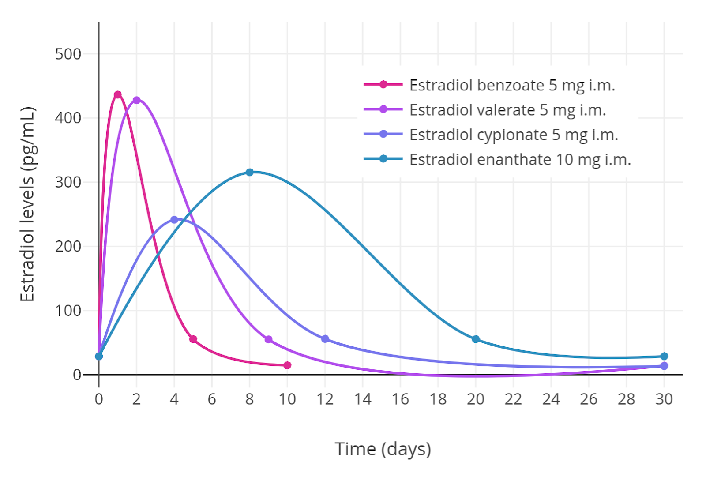
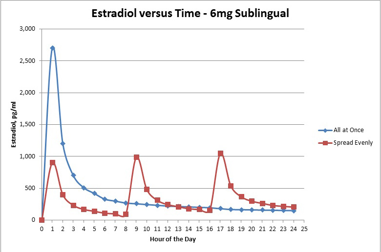
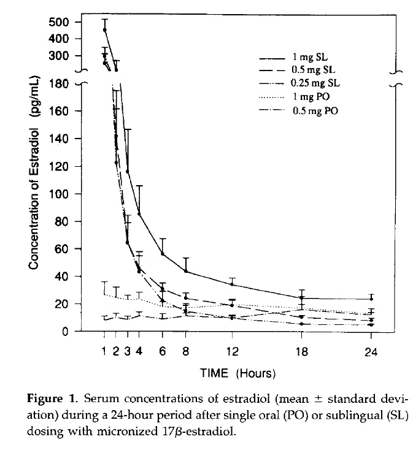
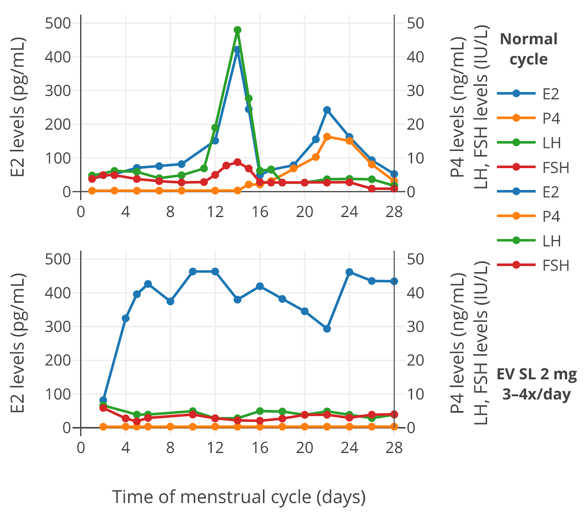

# Part 2 雌激素 (Estrogens)

## 雌激素的种类与介绍

### 雌二醇酯 (esters)

- 戊酸雌二醇 (Estradiol Valerate / EV)
  - 补佳乐
- 庚酸雌二醇 (Estradiol Enanthate / EEn)
- 环戊丙酸雌二醇 (Estradiol Cypionate / EC)
- 苯甲酸雌二醇 (Estradiol Benzoate / EB)
- 聚磷酸雌二醇 (Polyestradiol phosphate / PEP)

在跨性别女性中使用的雌二醇有——雌二醇与雌二醇酯(esters).雌二醇酯是雌二醇的前体药物 (既，在体内转换成雌二醇)，与雌二醇有着相似的生物活性.但它们被用于注射时会有更长久的 活性，由于在注射部位的吸收较慢.这使它们能够在给药时间上的频率降低.聚磷酸雌二醇(PEP) 是一种以聚合物(polymer)形式存在的雌二醇前药.它的代谢较缓慢，持续时间也很长.

### 合成雌激素 (Non-bioidentical estrogens)

- 炔雌醇 (Ethinylestradiol / EE)
  - 避孕药等药物 (如：优思明、妈富隆、英 达 35)
- 结合雌激素 (Conjugated estrogens / CEEs)
  - 绝经期激素治疗药物
- 己烯雌酚 (Diethylstilbestrol / DES)

人工合成雌激素，具有肝脏代谢抗性，在对雌激素调节的肝脏合成有不成比例的影响.而这结果 导致它们拥有更大的风险如：血栓与心血管疾病.同时因为风险原因以及在跨性别女性中需要 使用较高剂量的雌激素来达到有效地睾酮抑制，合成雌激素绝不应该使用于跨性别 HRT 中.

雌激素可以高剂量单独使用来抑制睾酮至女性范围水平.而低剂量的雌激素可以与抗雄激素或孕激素联合使用来达到比较接近生理水平的 E2.这将会导致雌激素部分 地抑制睾酮，并通过抗雄激素药物或孕激素来进一步地抑制或拮抗剩余的睾酮.但是，在 HRT 导入抗雄激素药物或孕激素药物也将增加这些药物带来的副作用与风险.

低水平的雌激素能带来的女性化作用在雄激素存在的影响下是有限的.高剂量的雌激素，除了能带来更强力的睾酮抑制能力之外，并不会带来更强的女性化作用.事实 上，有迹象表明高剂量雌激素可能会导致更差的乳房发育.高剂量雌激素的使用包括雌二醇，也将会提高血栓与心血管疾病的风险 (雌激素——血栓风险 篇).所以使用 生理水平剂量的雌激素可能较佳.但同时，高剂量雌激素在睾酮抑制方面上非常有用，而且非口服雌二醇给药途径所带来的风险较低.这也特别限于特定高风险人群如： 高龄、缺乏活动、肥胖症、伴随孕激素药物使用、吸烟、手术、易栓症等等.在健康年轻的人身上，高剂量非口服雌二醇的使用，在一定范围中，是可以接受的.

## 雌二醇 —— 给药途径

### 口服 (吞服) 、含服

口服雌二醇的形式有雌二醇与戊酸雌二醇(EV).雌二醇口服途径存在生物利用度问题，并且常导致低水平的雌二醇浓度，从而可限制其雌 激素作用以及导致睾酮抑制不足 (Wiki; Leinung et al., 2018; Leinung, 2014).口服用的雌二醇片可以用于舌下含服.雌二醇含服途径拥有比起口服 5 倍更高的生物利用 度，这约为~25%，相比于口服的 3-5% (Wiki).但是由于含服雌二醇的持续时间较短，所以建议分次服用来维持较稳定的雌二醇水平.口服 EV 片也像雌二醇片，可以被 用于含服.颊给药途径(buccal)也与舌下含服一样，具有相似的特性，但不常被使用. (详细看——舌下含服 篇)

### 透皮给药

雌二醇贴片可以被用于此给药途径，但可能需要 2~4 张贴片来达到足够的雌二醇水平以抑制睾酮 (雌二醇单疗的情况下) .同样的，

雌二醇凝胶也能用于此给药途径，但是可能必须使用较多分量的凝胶来达到足够的雌二醇水平.凝胶可以选择在生殖器上使用，特别是在阴囊 或术后阴唇上，在此部位使用凝胶比用于其他部位如手臂、腹部、臀部相比更能达到 较高的雌二醇水平. (详细看——透皮给药 篇)

### 注射

对于雌二醇酯的注射，可以选择肌肉注射或皮下注射.皮下注射比较容易实行，更不痛且比肌注更方便，是优选的注射方式.雌二醇酯注射能达到高水平的雌二醇，并且取决于使用的酯(ester)，持续时间可长达数天或数周.一种雌二醇注射——聚磷酸雌二醇(PEP)与其他雌二醇酯不 同，必须使用肌注，其效用持续时间可长达数月 (半衰期为 70 天) .但是 PEP 大多仅限于北欧地区 (Wiki).

由于口服雌二醇会导致在肝脏内非常高的雌酮(E1)水平，而且对雌激素调节的肝蛋白合成有着不成比例的影响，虽然非口服途径比较不方便， 但还是优选的.特别是在需要使用更高雌激素剂量来抑制睾酮的情况下，口服途径会提高血栓、心血管疾病等风险.这些风险在选择非口服途径 时能大幅地降低.

## 雌二醇 —— 剂量

<table>
	<thead>
		<tr>
			<td>药物</td>
			<td>给药途径</td>
			<td>形式</td>
			<td>剂量</td>
		</tr>
	</thead>
	<tbody>
		<tr>
			<td rowspan="5">雌二醇</td>
			<td>口服</td>
			<td>片剂</td>
			<td>2–8 mg/天</td>
		</tr>
		<tr>
			<td>含服/口颊给药</td>
			<td>片剂</td>
			<td>0.5–2 mg (1–4 次/天)</td>
		</tr>
		<tr>
			<td>透皮给药</td>
			<td>贴剂</td>
			<td>50–300 μg/天</td>
		</tr>
		<tr>
			<td>透皮给药</td>
			<td>凝胶</td>
			<td>2–6 mg/天</td>
		</tr>
		<tr>
			<td>皮下植入</td>
			<td>Pellet</td>
			<td>25–150 mg/6 个月</td>
		</tr>
		<tr>
			<td rowspan="3">戊酸雌二醇 (EV)</td>
			<td>口服</td>
			<td>片剂</td>
			<td>2–10 mg/天</td>
		</tr>
		<tr>
			<td>含服/颊给药</td>
			<td>片剂</td>
			<td>0.5–2 mg (1–4 次/天)</td>
		</tr>
		<tr>
			<td>肌注/皮下注射</td>
			<td>油溶液</td>
			<td>2–6 mg/周； 1.5–4 mg/5 天； 或 5–7 mg/5天*</td>
		</tr>
		<tr>
			<td>庚酸雌二醇 (EEn)</td>
			<td>肌注/皮下注射</td>
			<td>油溶液</td>
			<td>4–12 mg/两周；11 mg/周\*；或 15mg/10 天</td>
		</tr>
		<tr>
			<td>环戊丙酸雌二醇 (EC)</td>
			<td>肌注/皮下注射</td>
			<td>油溶液</td>
			<td>2–6 mg/周</td>
		</tr>
		<tr>
			<td>苯甲酸雌二醇 (EB)</td>
			<td>肌注/皮下注射</td>
			<td>油溶液</td>
			<td>1–3 mg 两次/周</td>
		</tr>
		<tr>
			<td>聚磷酸雌二醇 (PEP)</td>
			<td>肌注</td>
			<td>水溶液</td>
			<td>40–160 mg/月**</td>
		</tr>
	</tbody>
</table>

\*单药治疗

\*\*PEP 的情况，起初的第一次或两次剂量可以使用 240–320 mg，以更快速地达到稳态血药浓度.

雌二醇治疗中个体之间能达到的雌二醇水平差异非常大.也就是说，使用相同剂量下达到的 雌二醇水平在每个人之间可能存在着非常大的差异.这差异在口服与透皮雌二醇途径中最 大.因此，雌二醇的推荐剂量不是绝对的，而应该根据情况以及血液检查来进行个体化.同时 也应注意的是，检测出的雌二醇水平数值在每份报告中存在着差异，特别是含服与注射途 径.但是，这种变化是可以预测，并且可以通过适当的血液检查时机将其最小化的.

在性腺去除后 (睾丸切除手术或 SRS)，雌激素剂量可以降低或调整至女性生物水平范围.绝 经前女性的平均雌二醇分泌水平在一个月经周期内为约 6 mg ([Rosenfield et al., 2008](https://scholar.google.com/scholar?cluster=9979206541205334235)).

### 雌二醇注射单药治疗 (monotherapy) 的推荐剂量

#### EV 注射剂量 —— 5–7 mg/5 天

最佳的注射剂量是把剂量调低，但是把注射周期调整为其半衰期 (5 天) .这可以避免高剂量 EV 所导致 在注射后的 1~2 天内产生非常高的峰值水平.用于绝经后女性的标准治疗剂量 (10 mg/7 天) 不适合用于 跨性别女性中，这剂量会导致注射后 1~2 天内非常高的 E2 水平峰值.符合其半衰期的 5–7 mg/5 天的剂量 可以避免身体经历巨大的峰值与非常低的谷浓度带来的影响.大幅变化的 E2 水平可能会产生情绪影响 等生理现象.

#### EEn 注射剂量 —— 11 mg/周 (7 天)

每周 11 mg 的 EEn 剂量平均所能产生的 E2 水平为平均 300–400 pg/mL.这剂量所能产生的 E2 水平能有效 地把睾酮抑制至 <50 ng/dL 以下，而这注射周期也符合 EEn 半衰期的~7 天.

## 雌二醇酯注射 —— 水平 (图表)

Graph：Simplified curves of estradiol levels after intramuscular injection of different estradiol esters in oil solution in women. ([Garza-Flores, 1994](https://www.google.com/url?q=https://doi.org/10.1016%252F0010-7824%252894%252990032-9&sa=D&source=editors&ust=1650986830854456&usg=AOvVaw1Bg5kYMpCWOXGC2k2JO0to))

Estradiol benzoate (EB)：苯甲酸雌二醇

Estradiol valerate (EV)：戊酸雌二醇

Estradiol cypionate (EC)：环戊丙酸雌二醇

Estradiol enanthate (EEn)：庚酸雌二醇

*此图表的曲线是拟合的且检测间隔较长，所以实际情况可能会与其有较大偏差

## 雌二醇 —— 水平

|      给药途径      |        低剂量         |         中剂量         |         高剂量         |        超高剂量         |
| :----------------: | :-------------------: | :--------------------: | :--------------------: | :---------------------: |
|      口服(A)       |        2 mg/天        |        4 mg/天         |        8 mg/天         |        12 mg/天         |
|  含服/口颊给药(B)  |      0.5–1 mg/天      |       1–2 mg/天        |       2–4 mg/天        |        3–6 mg/天        |
|      透皮贴片      |       50 μg/天        |       100 μg/天        |       200 μg/天        |        300 μg/天        |
|      透皮凝胶      |       1.5 mg/天       |        3 mg/天         |        6 mg/天         |         9 mg/天         |
|   肌注/皮下注射    |        1 mg/周        |        2 mg/周         |        4 mg/周         |         6 mg/周         |
|      皮下植入      |     25 mg/6 个月      |      50 mg/6 个月      |     100 mg/6 个月      |      150 mg/6 个月      |
| 平均雌二醇(E2)水平 | 50 pg/mL (184 pmol/L) | 100 pg/mL (367 pmol/L) | 200 pg/ml (734 pmol/L) | 300 pg/mL (1101 pmol/L) |
|    相等月经周期    |        卵泡期         |         全周期         |         黄体期         |         排卵期          |

A. 口服雌二醇 1.5 mg = 口服雌二醇 酯 2 mg.

B. 含服雌二醇拥有比口服高~2–5 倍 的生物利用度.

C. 如果用于生殖器上，可以使用更 低剂量的透皮雌二醇.

D. 肌注或皮下注射：一周的雌二醇酯 总剂量(EV/EEn/EC/EB).这些酯之 间的分子量差异非常小所以可忽 略不计 ([Wiki-Table](https://en.wikipedia.org/wiki/Template:Structural_properties_of_selected_estradiol_esters)).最佳注射间隔 取决于所用的雌二醇酯的半衰期.

★ 这些剂量不是绝对性的，所以 只应该作为一个非常粗略的 参考.这些数据基于不同研究 的广义模型，且具有非常大的 个体差异.

★ 这些剂量只是一般估计的等 效剂量，不是典型或推荐的临 床剂量.

请注意：雌二醇剂量能达到的雌二醇水平存在着非常大的个体差异 (剂量导致的水平因人而异) .同时也该注意的是，某些给药途径存在着较大的 时间依赖性的水平波动，主要是含服/口颊给药、肌注/皮下注射 ([Wiki-Graphs](https://en.wikipedia.org/wiki/Template:Hormone_levels_with_sublingual_estradiol); [Wiki-Graphs](https://commons.wikimedia.org/wiki/File:Estradiol_levels_during_therapy_with_0.25_mg_buccal_estradiol_in_postmenopausal_women.png); [Wiki-Graphs](https://en.wikipedia.org/wiki/Template:Hormone_levels_with_estradiol_esters_by_intramuscular_injection)).

对于还没经历或不打算进行性腺切除手术的跨性别女性，可以使用较高剂量的雌二醇来达到强力的睾酮抑制.平均上，高剂量雌二醇的使用会抑 制 90%的睾酮水平 (至约 50 ng/dL) .所以“高剂量”与“超高剂量”的使用通常用于雌二醇单疗 (不使用抗雄激素药物，而只是使用雌二醇).

Sources: [Kuhl (2005); Bruni, V., & Pampaloni, F. (2019)](https://doi.org/10.1007/978-3-030-14358-9_10)

## 雌二醇 —— 舌下含服

由于跨性别者之间对于口服与含服的差别有些许困惑，这篇将会粗略地讲解下这背后的原理.

当微粉化雌二醇(micronized estradiol)被用于口服 (吞服) 时，它的生物利用度最大为~5%.简单地来说，95%其实都会被浪费掉.而舌下含服的生物利用度为最大~25%，是口服的 5 倍.这 是主要因为如果当雌二醇用于口服时，一部分在体内会被胃酸破坏，而剩下的则被肝脏代谢掉 (Kuhl, Zhang).肝脏将会把有效的雌二醇转化成效力较低的雌酮(Estrone; E1)与硫酸雌 酮(Estrone sulfate; E1S)，这在长期的使用下也会加重对肝脏的负担.但如果把雌二醇作为含服来使用，口腔粘膜能将一定分量的雌二醇直接吸收到血液中，这能大量的避免经过肝脏 代谢，从而导致更高的利用度 (Zhang).虽然最终肝脏也会代谢掉大量的雌二醇，但这比口服的时候被肝代谢的分量较少.虽然口内唾液也会破坏掉一部分的雌二醇，但这也比胃酸能 破坏掉的雌二醇少(Kuhl).

另外一点关于口服雌二醇的是 —— 当雌二醇作为口服使用时，肝脏把有效的雌二醇(E2)转化成雌酮(E1)，而这 E1:E2 的比例一般为 5:1 (Kuhl, 2005)，但也发现可高达 10:1、20:1 ([Kuhnz, Gansau, & Mahler, 1993](https://pubmed.ncbi.nlm.nih.gov/8240460/))，也可能高达 30:1.

雌酮是种非常低效力的雌激素.同时雌酮在硫酸雌酮(E1S)形态时除了拥有比雌二醇较长的半衰期以及可以转化成雌二醇之外，它在体内真正的作用还未被完全了解.

Graph A: 含服 6 mg 剂量一次服用 vs 含服 6 mg 剂量分次服用(2 mg x3 次)

**剂量服用**：含服雌二醇时最理想的方式是分次服用.这是因为含服时会导致庞大的 峰值与低谷，并不像口服雌二醇一样能保持较稳定的水平.含服导致的雌二醇水平在 片剂完全融化后 5 分钟内开始迅速上升，30–60 分钟后达峰值浓度，可达的峰值浓度 水平是口服的 10 倍高.这雌二醇水平在 4 小时后开始急速下降，而含服雌二醇的半衰 期为~8 小时起.

基于 (Price, 1997) 这项研究，我们可以参考这图表 (Graph A) 来评估含服一次性服 用与分次服用的差别.

这图表显示了一次性服用 6 mg 剂量会达到非常高的峰值水平.但是，许多研究已经证 明了人体不能处理超过 800–1000 pg/mL 的雌二醇，所以超过该极限的雌二醇基本上 都只流淌在血液中不带来任何好处，完全被浪费掉.

Sources: [Kuhl (2005)](https://www.google.com/url?q=https://doi.org/10.1080/13697130500148875&sa=D&source=editors&ust=1650986839563747&usg=AOvVaw2gNWQ_c0Qtc8sZaUBvkI4l); [Price et al. (1997)](https://www.google.com/url?q=https://doi.org/10.1016/S0029-7844(96)00513-3&sa=D&source=editors&ust=1650986839566344&usg=AOvVaw0yHpeGDQI4uzSlqgurFiA5); [Zhang et al. (2002)](https://www.google.com/url?q=https://doi.org/10.2165/00003088-200241090-00003&sa=D&source=editors&ust=1650986839566803&usg=AOvVaw2fWgPgXzzZUpwqcvIrsLGn)

## 口服 vs 含服雌二醇 —— [Price et al. (1997)](https://doi.org/10.1016/S0029-7844(96)00513-3)

SL = 含服

PO = 口服

此图表显示主要 1 mg 雌二醇含服与口服在女性体内 24 小时的雌二醇水平.

含服导致非常高的尖峰水平，而口服导致的雌二醇水平非常低但是较稳定.同时也需注意，含服导致的峰值不但更高，其导致的平均雌二醇水平值也比口服更高.这显示了口服雌二醇大幅劣于含服.

## 舌下含服 —— 备注

有时候听见一些乱传闻的跨性别女性说戊酸雌二醇(EV)片不能含服，这不正确.这篇将格外为困惑的姐妹们说明.

右图为分别 Serhal & Craft 的研究.此研究使用了戊酸雌二醇(EV)片——补佳乐(Progynova)，绝经前女 性含服 3–4 次/天 剂量. 

- [Serhal, P., & Craft, I. (1989). Oocyte donation in 61 patients. The Lancet, 333(8648), 1185–1187.](https://doi.org/10.1016/S0140-6736(89)92762-1) 
- [Serhal, P. (1990). Oocyte donation and surrogacy. British Medical Bulletin, 46(3), 796–812.](https://doi.org/10.1093/oxfordjournals.bmb.a072432)

这研究显示了 EV (补佳乐) 被良好地吸收并且与含服雌二醇一样达到了相似的雌二醇水平.

另外值得注意的文献摘录：[Lim et al. (2019)](https://doi.org/10.5468/ogs.2019.62.1.46)

全部口服雌二醇片都是经过微粉化过的，而 Serhal & Craft 研究中使用的口服戊酸雌二醇(EV)也是如 此.微粉化(micronization)被认为是对于舌下含服途径的吸收上非常重要的处理 ([Sayeed & Ashraf, 2014](https://www.pharmtech.com/view/considerations-developing-sublingual-tablets-overview) ).

似乎补佳乐(Progynova)，或可能全部口服 EV 片都是与口服雌二醇片一样，都是被微粉化过的 ([Devroey & Pados, 1998](https://doi.org/10.1093/humupd/4.6.856)).

然而可能要注意的是，口服雌二醇、EV 片一般上是被作为口服药物而制造的，不是专门用于舌下含服 途径的.虽然许多此类片剂显然可以通过舌下含服途径被很好地吸收，但是这些片剂可能会在外层上 有差异——糖衣或薄膜衣 (sugar-coated or film-coated)，而这可能会影响片剂溶解时间.这似乎对 EV 片 的生物利用度没有不利影响，但应牢记不同品牌的雌二醇/EV 片在含服使用时可能会在溶解度中有所 不同.

## 雌二醇 —— 透皮给药

透皮途径是一种被广泛使用的雌二醇给药途径，现有的研究显示透皮雌二醇在女性化效果上与口服雌二醇相比没有任 何差异.虽然两种途径都可以被使用，但口服导致的代谢问题是非生理性的，也同时与血栓、心血管疾病有着很大的关 联.而低量的透皮雌二醇使用不存在这种风险，是比口服雌二醇更优势的给药途径.

### 药理

雌二醇贴剂的话必须持续贴在皮肤上，一般上一周两个贴剂、或一周一次.雌二醇贴片 50 μg/天的剂量被认为具有与口服雌二醇的 1–2 mg/天剂量、或 1.5 mg/天的凝胶剂量具有 同等效力([Kuhl, 2005](https://doi.org/10.1080/13697130500148875); [Järvinen, Nykänen & Paasiniemi, 1999](https://doi.org/10.1016/S0378-5122(99)00021-3)).但是这存在着非常大的个体差异，所以这剂量不是通用剂量.

雌二醇在女性体内是从卵巢分泌到循环系统的，所以肝脏不会暴露在过量激素的影响下 ([Gravholt et al., 2017](https://doi.org/10.1530/EJE-17-0430)).透皮雌二醇能有效地模仿这行为.而口服雌二醇由于会通过胃肠道，与 雌激素的过量暴露有关 ([Bińkowska, 2014](https://doi.org/10.5114/pm.2014.46468)).这行为导致口服与透皮雌二醇存在着许多差异.口服雌二醇的 95%被代谢成为雌酮以及其他微弱的雌激素 ([Kuhz, Blode & Zimmermann, 1993](https://doi.org/10.1007/978-3-642-60107-1_15) ).雌酮(E1)与雌二醇(E2)在成人女性、青春期女性中是 1:1 比例，这与透皮雌二醇途径带来的比例相似 (Kuhl, 2005; [Frederiksen et al., 2020](https://doi.org/10.1210/clinem/dgz196)).而一份口服雌二醇剂量在绝经后女性中 发现雌酮的浓度为比雌二醇高 5 倍 (Kuhl, 2005).在某些患者中，雌酮的浓度可高达 20 倍.由于这原因，口服雌二醇的代谢被认为是非生理性的([Gravholt et al., 2017](https://doi.org/10.1530/EJE-17-0430); [Mauras et al., 2019](https://doi.org/10.1111/cen.13869)).

### 功效

在跨性别者之间最常讨论的话题“哪个 HRT 方式最有效助于乳房发育？”.迄今为止，不存在可以评估乳房发育效果的随机对照试验 ([Reisman, Goldstein & Safer, 2019](https://doi.org/10.4158/EP-2019-0183); [Iwamoto et al., 2019](https://doi.org/10.1177%2F2042018819871166)).同时在科学界内也没有被普遍认可的乳房发育衡量指标.但尽管如此，许多观察性研究已经研究过并量化了通过雌激素治疗导致的女性化——([Wierckx et al., 2014; de Blok et al., 2018](https://doi.org/10.1111/jsm.12571)).虽然乳房发育没被衡量，但一项回顾性研究发现在不同雌激素使用者之间的丰胸需求率没有统计性差异 ([Seal et al., 2012](https://doi.org/10.1210/jc.2012-2030)).这表明口服雌二醇(EV)可能与其他的雌激 素 (口服结合雌激素、口服炔雌醇) 没有功效差异.最后，在一项针对跨性别女性的大型研究发现，女性型脂肪与男性型脂肪在口服与透皮雌二醇之间不存在统计性差异 ([Klaver et al., 2018](https://doi.org/10.1530/EJE-17-0496) ).

结论，目前所有临床研究表明雌二醇给药途径之间没有可测量的差异.综合起来，这些研究表明了乳房发育或女性化与雌激素的给药途径无关.

### 安全性

一项关键的研究发现低剂量的口服雌二醇 (2 mg/天 或更低) 对静脉血栓栓塞发生率有着轻微但值得重视的负面影响，而低剂量透皮雌二醇 (100 μg/天或更低) 则不会导致 此风险的上升 ([Scarabin, 2014](https://doi.org/10.1159/000360554)).因此，透皮雌二醇与口服雌二醇相比，在此风险上有极大优势 ([Files & Kling, 2020)](https://doi.org/10.1080/17425247.2020.1700949).

### 结论

口服与透皮雌二醇在代谢上有差异.口服雌二醇在进入循环系统之前，大量都会被肝脏代谢 转化为雌酮和其他雌激素代谢物.而相反的，透皮雌二醇能避免肝脏的代谢，从而避免雌二 醇转化为低效力的雌激素代谢物.

同时，没有研究表明口服雌二醇与透皮雌二醇在女性化效果中有任何差异 .反而现有的研究 显示乳房发育、脂肪分配等女性化效果与雌二醇摄取途径没有任何关系.因此，透皮雌二醇 在生理性剂量上可比口服雌二醇在长期使用中更安全. Additional: Cirrincione et al. (2021)

Additional: [Cirrincione et al. (2021)](https://doi.org/10.1089/lgbt.2020.0249)

