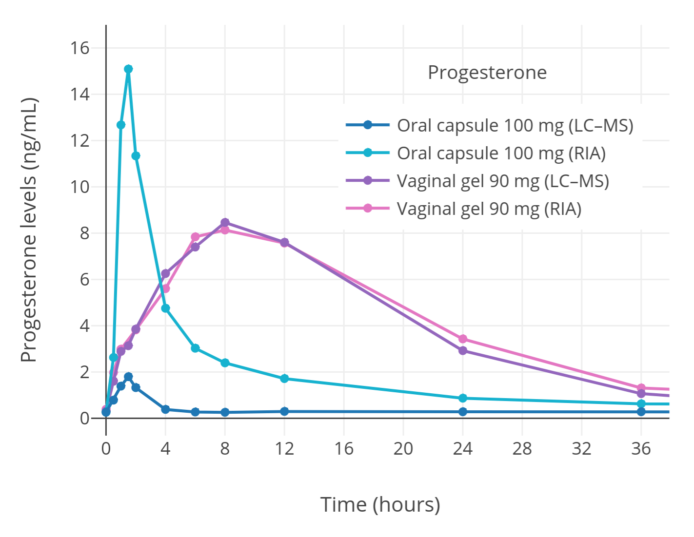
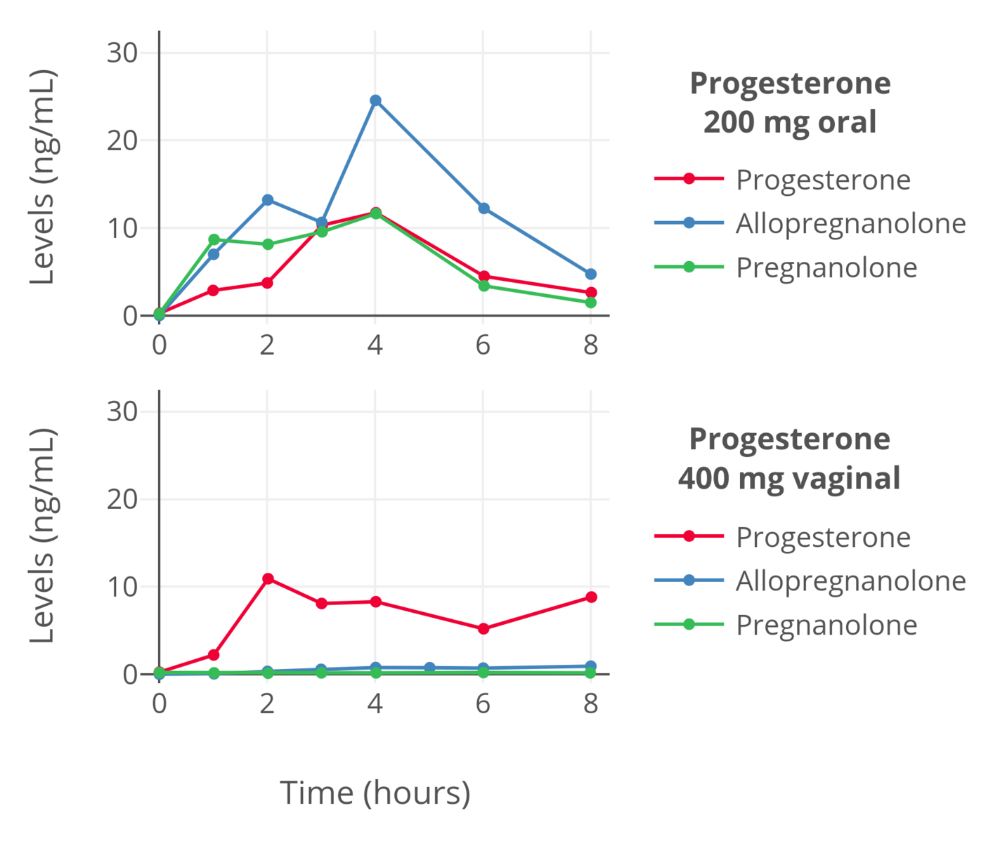
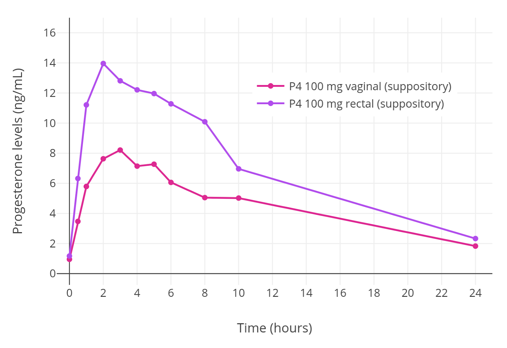

# Part 5 孕激素 (Progestogens) 篇

## 孕激素 —— 介绍

孕激素 (Progestogens) 分别包括两种——黄体酮 (Progesterone)、黄体制剂 (Progestins).黄体制剂是一种通过黄体酮(P4)与睾酮的结构改造所衍生的合成孕激素.一些主要的黄体制剂包括：醋酸甲羟孕酮(MPA)、炔诺酮(NET)、地屈孕酮(Dydrogesterone)、以及屈螺酮(Drospirenone).存在着非常多的黄体制剂，它们在结构上不同且拥有不同的特性 ([Wiki-Table](https://en.wikipedia.org/wiki/Template:Progestogens_marketed_for_clinical_or_veterinary_use)).黄体制剂被研发是因为它们在体内更适合用作药物.虽然从理论上任何孕激素都可以被使用，但只有少数临床上的孕激素被使用在跨性别 HRT 中.

大多数的孕激素都具有不良的脱靶激素活性/off-target hormonal activities ([Kuhl, 2005;](https://doi.org/10.1080/13697130500148875) [Stanczyk et al., 2013](https://doi.org/10.1210/er.2012-1008); [Wiki-Table](https://en.wikipedia.org/wiki/Template:Pharmacodynamics_of_progestogens)).黄体酮具有能导致各种大脑作用的神经甾体 活性，而黄体制剂不具有其活性.MPA 以及 NET 与其衍生物具有微弱的雄激素活性，这对跨性别女性 HRT 比较不利.NET 与某些相关的黄体制剂在高剂量的使用下可产 生炔雌醇(EE)作为其代谢物，并会导致类似 EE 的雌激素作用——包括血栓、心血管疾病等风险.其他孕激素的脱靶活性包括抗雄激素、糖皮质激素、以及抗盐皮质激 素活性.这些作用会导致治疗效果 (如：雄激素抑制或拮抗) 、副作用、健康风险发生变化.

另外，在雌激素治疗上添加孕激素可增加许多不利的健康风险.这些风险包括血栓、冠状动脉疾病、乳癌等.高剂量孕激素也与某些非癌性的脑瘤有关，这包括泌乳素 瘤与脑膜瘤.冠状动脉疾病风险可能是由特定的孕激素所持有的弱雄激素活性，从而导致的血脂变化所引发的 (Stanczyk et al., 2013; [Jiang & Tian, 2017](https://doi.org/10.1186/s12944-017-0612-5)).除了健康风险 之外，孕激素也与不良的情绪变化有关，但目前这没有足够的证据来证明.

与黄体制剂相反地，黄体酮没有不良的脱靶活性，而且在雌激素治疗上添加黄体酮不会增加血栓风险.此外，口服黄体酮的短期使用似乎比黄体制剂的使用拥有更低 的乳癌风险，虽然长期的影响下并不如此.因此，黄体酮已被提议应该首选黄体酮来代替黄体制剂在治疗上使用.但同时，黄体酮的安全性可能与口服黄体酮能产生的 水平非常低以及其低剂量的使用有关.非口服黄体酮在能造成强烈孕激素作用的剂量下还未在健康、风险上进行过适当的评估，所以或许存在着与黄体制剂相同的风 险.

黄体酮在女性化或乳房发育上除了有助于抑制睾酮之外，目前还尚无明确或已知的益处.尽管有些跨性别女性声称孕激素可改善乳房发育，但在目前所有的理论与研 究结果并不支持“孕激素可助于改善乳房大小或形状”这一论点.而过早引入孕激素反而可能会对乳房发育产生不利的影响.许多跨性别女性也声称孕激素会带来对性 欲正面/有益的影响.但是，现有文献表明情况正好相反——孕激素具有对性欲的抑制作用——但这可能只是高剂量所持有的特性.

由于它们对女性化和乳房发育缺乏影响力，并且能导致如健康风险等不利影响，孕激素目前不被常规使用在跨性别 HRT 中.但是一个例外为——醋酸环丙孕酮(CPA)， 一种被广泛使用在跨性别 HRT 中的抗雄激素药物，也同时在典型的治疗剂量下是个非常强力的孕激素.虽然孕激素有许多风险，但女性体内也有黄体酮(P4)且决定性 风险在健康个体中是非常低的.乳癌也是需要数年来形成的.而且孕激素所带来的的睾酮抑制在跨性别女性中非常有用.短期的孕激素使用可以在进行睾丸切除术前作 为睾酮抑制的一种方法.

## 孕激素 —— 给药途径

黄体酮可以用于口服、直肠给药途径、或肌注和皮下注射.而黄体制剂(Progestins)通常用于口服，但是 某些黄体制剂也以注射液形式存在 (如：“日孕”OHPC).

### 口服

使用最先进 [LC–MS](https://en.wikipedia.org/wiki/Liquid_chromatography%E2%80%93mass_spectrometry) 分析法已发现口服途径的黄体酮能达到的 P4 水平非常低 (<2 ng/mL @ 100 mg/天 剂量)，不足以产生让人满意的孕激素作用.因此，即使 是高剂量的口服黄体酮也在男性身上没有抗促性腺激素作用.这与非口服黄体酮和黄体制剂形成了鲜明的对比.另外，口服黄体酮会过度转化为强效的神经甾体代谢 物如——别孕烷醇酮(allopregnanolone)、孕烯醇酮(pregnanolone)，而这会导致不良的酒精类似副作用如：镇静作用、认知/记忆障碍、情绪变化.因此，虽然不方便，非 口服黄体酮可能是较优选的.另外一方，黄体制剂(progestins)具有非常高的口服生物利用度以及对肝脏代谢的抗力.与 ERs 相反，孕激素受体(PRs)在肝脏内表达得非 常少或完全不表达 ([Lax, 1987](<https://doi.org/10.1016/0022-4731(87)90198-1>)).由于这原因，黄体制剂在口服途径上没有明显问题.

### 舌下含服

含服用的黄体酮片比较少见，仅在某些东欧地区可用.口服黄体酮一般上被配制为油胶囊，这使得它们难以通过舌下含服途径服用.

### 直肠给药

黄体酮可以作为肛门栓剂使用.微粉化口服黄体酮胶囊可以通过直肠给药途径来达到比口服途径更高的 P4 水平.虽然不方便，但直肠给药途径可能是 跨性别女性能服用黄体酮的最佳给药途径. (详细看——黄体酮 —— 非口服给药途径)

### 注射

黄体酮注射分别为肌注和皮下注射两种形式存在.但是黄体酮注射的持续时间相对较短，必须每 1~3 天注射一次.这使得大多数的人使用起来不方便.与雌二 醇不同，在化学上不可能有比黄体酮本身更长持续时间的黄体酮酯.另一方面，可注射的黄体制剂的持续时间可长达数周~数月.

## 孕激素 —— 推荐剂量

<table>
	<thead>
		<tr>
			<td>药物</td>
			<td>给药途径</td>
			<td>形式</td>
			<td>推荐剂量</td>
		</tr>
	</thead>
	<tbody>
		<tr>
			<td rowspan="4">黄体酮 (Progesterone)</td>
			<td>口服</td>
			<td>充油胶囊</td>
			<td>100–300 mg，1–2x/天</td>
		</tr>
		<tr>
			<td>直肠</td>
			<td>栓剂；充油胶囊</td>
			<td>100–200 mg，1–2x/天</td>
		</tr>
		<tr>
			<td>肌肉注射</td>
			<td>油溶液</td>
			<td>25–75 mg/1–3 天</td>
		</tr>
		<tr>
			<td>皮下注射</td>
			<td>水溶液</td>
			<td>25 mg/天</td>
		</tr>
		<tr>
			<td>黄体制剂 (Progestins)</td>
			<td>口服；肌注或皮下注射</td>
			<td>片剂；油/水溶液</td>
			<td>~多样~</td>
		</tr>
	</tbody>
</table>

各种黄体酮剂量、形式、途径所达的 P4 水平，可以看：[Wiki-Table](https://en.wikipedia.org/wiki/Template:Plasma_progesterone_levels_after_a_single_dose_of_progesterone_by_different_routes)

与雌二醇一样，黄体酮所达到的 P4 水平存在着很大的个体差异.但是黄体制剂的情况则相反，个体之间水平差异相对较小. 除去性腺后可以降低或调整孕激素的剂量来使其接近正常女性生理水平，或者可以完全停止使用孕激素.

## 口服黄体酮 —— 低水平、极弱的孕激素作用

微粉化口服黄体酮(oral micronized progesterone)，一种用于口服途径的黄体酮药物.这是一种明胶胶囊，里面含有微粉化黄体酮晶体的油悬浮剂.口服途径的黄体酮会首先通过肠道与 肝脏，导致它的生物利用度非常低(≤10%).由于首过效应的原因，大量的黄体酮会在抵达血液前转化为别孕烷醇酮(allopregnanolone)、孕烯醇酮(pregnanolone)等神经甾体代谢物.这是 为什么口服黄体酮会导致与非口服途径没有的酒精类似副作用 (如：镇静作用) .尽管口服途径的生物利用度非常低，但根据以前的报道，使用 IAs 分析法测量的结果，典型临床剂量 100–300 mg/天仍可产生与月经后期——黄体期同等的 P4 水平 ([Wiki-Graph](https://commons.wikimedia.org/wiki/File:Progesterone_levels_across_the_normal_menstrual_cycle_in_women.png)).

但现在我们知道那是错误的.IA 是一种较早期的分析法，存在着准确性和可靠性问题.用于测定黄体酮所使用 的抗血清(antiserum)会与其代谢产物 (如：[5α-DHP](https://en.wikipedia.org/wiki/5%CE%B1-Dihydroprogesterone)、孕烷醇酮、孕烯醇酮) 发生交叉反应，并将它们计入黄体酮 (P4)的总数中.这导致明显地高估了口服黄体酮产生的 P4 水平.使用先进分析法的研究，包括 “[LC-MS](https://en.wikipedia.org/wiki/Liquid_chromatography%E2%80%93mass_spectrometry)”，是被视 为测量性激素水平的“黄金标准” ([Kuhl & Schneider, 2013](https://doi.org/10.3109/13697137.2013.768806); [Woodward & Rumsby, 2019](https://doi.org/10.1007/978-3-319-96364-8_3); [Conklin & Knezevic, 2020](https://doi.org/10.1016/j.clinbiochem.2020.03.008) )，以及使用适量[色谱分离](https://en.wikipedia.org/wiki/Chromatography) IAs 的研究表明了口服途径导致的黄体酮水平确实非常低 ([Kuhl, 2011](https://www.kup.at/journals/summary/10168.html); Kuhl & Schneider, 2013; [Davey, 2018](https://doi.org/10.1080/13697137.2018.1439915)).

一项使用 LC-MS 的研究发现口服 100 mg 黄体酮后， 24 小时内最高的 P4 水平为 2 ng/mL，而平均水平只有仅仅的 0.14 ng/mL (图 1 ; [Wiki-Table](https://en.wikipedia.org/wiki/Template:Pharmacokinetics_of_progesterone_with_LC%E2%80%93MS_versus_IA)).最新一项使用 LC-MS/MS 的研究发现，在 100 mg 剂量口服黄体酮与食物的一同服 用所导致的峰值 P4 水平为 2.5–3 ng/mL，而 24 小时内的平均水平为 0.6 ng/mL ([Wiki-Graph](https://commons.wikimedia.org/wiki/File:Progesterone_levels_with_100_mg_oral_progesterone_in_postmenopausal_women.png)). (食物提高口服黄体 酮的生物利用度数倍; [Wiki](https://en.wikipedia.org/wiki/Pharmacokinetics_of_progesterone#Absorption,_bioavailability,_and_levels)) 但是这些 P4 水平还是与通常黄体期水平的 7–22 ng/mL 相差非常大 (with LC-MS/MS; [Table](https://imgur.com/a/GnCSlxP)).有些比较过 IAs 与其 他更可靠分析法的结果后，并发现 IAs 高估了 P4 水平至 5–8 倍 (Kuhl, 2011; Kuhl & Schneider, 2013; Davey, 2018)

这些研究在科学与医学界仍然鲜为人知，但是现在我们可以很清楚口服黄体酮达到的 P4 水平远低于先前已了 解的，并大幅低于跨性别女性理想的生理性水平.

图 1 ：服用口服与阴道黄体酮后，使用 IA 和 LC-MS 检测到绝经后女性的 P4 水 平 —— 口服黄体酮所达最高水平不超过 2 ng/mL ([Levine & Watson, 2000](https://doi.org/10.1016/S0015-0282(99)00553-1); Kuhl & Schneider, 2013)

## 口服黄体酮 —— 作用、影响

数十年来，人们对口服黄体酮的临床孕激素作用所产生的各种令人困惑的发现，都可以用现在更先进可靠的分析方式、最新的数据轻松解明. 口服黄体酮在临床医学中主要用于在更年期女性中保护子宫内膜被雌激素无抵抗的刺激 ([Wiki](https://en.wikipedia.org/wiki/Progesterone_(medication)#Menopause)).即使口服途径产生的 P4 水平较低，它也能够可 靠地预防由雌激素介导的子宫内膜增生 ([Wiki](https://en.wikipedia.org/wiki/Progesterone_(medication)#Menopause)).但是在一项大型观察性研究中，它却未能提供足够的保护以抵抗雌激素介导的子宫内膜癌风险 ([Davey, 2018](https://doi.org/10.1080/13697137.2018.1439915)).口服黄体酮也在产生完整的子宫内膜转化上失败 (黄体期 P4 水平的正常作用)，即使使用非常高的剂量.而注射与阴道内给药途径 却有效.由于这原因，口服黄体酮被认为不适用于辅助生殖上 ([de Ziegler et al., 2013](https://books.google.com/books?id=LUpDAAAAQBAJ&pg=PA117)).另外，口服黄体酮即使在高剂量中也无法抑制男性体内的睾酮 ([Trollan et al., 1993](https://doi.org/10.1159/000292636)).而相反的，黄体制剂(Progestins)、直肠途径黄体酮、以及黄体酮注射都在睾酮抑制作用上非常有效 ([Wiki](https://en.wikipedia.org/wiki/Pharmacodynamics_of_progesterone#Antigonadotropic_effects)).同样的，口服 黄体酮在更年期女性中也没有明显的抗促性腺激素作用 ([Holst, 1983](https://doi.org/10.3109/00016348309155363); [Holst et al., 1983](https://doi.org/10.1016/0378-5122(83)90015-4); [Ottosson, 1984](https://doi.org/10.3109/00016348409157016); [Maxson & Hargrove, 1985](https://doi.org/10.1016/S0015-0282(16)48977-6); [Saarikoski, Yliskosk, & Penttilä, 1990](https://doi.org/10.1016/0378-5122(90)90086-L)).

与其他临床上使用过的孕激素不同，在更年期女性的雌激素治疗中短期(<5 年)添加口服黄体酮不会造成 VTE/血栓等风险或乳癌风险.但是，长期(≥5 年)在雌激素治疗中与口服黄体酮的组合与乳癌风险显着相关 ([Wiki-Table](https://en.wikipedia.org/wiki/Template:Worldwide_epidemiological_evidence_on_breast_cancer_risk_with_menopausal_hormone_therapy)).这与口服黄体酮对乳房增殖作用非常弱这点一致，因此需要更 长的暴露下才能体现出可量化的乳癌风险增加 (Kuhl & Schneider, 2013; Davey, 2018).这也与临床前研究一致，该研究清楚表明了黄体酮与孕激 素受体激活的致癌作用 (Kuhl & Schneider, 2013; [Trabert et al., 2020](https://doi.org/10.1210/endrev/bnz001)).先前关于口服黄体酮的子宫内膜作用、睾酮与促性腺激素的抑制、血栓风 险、乳癌风险的临床研究与几乎所有临床上使用的黄体制剂(Progestins)相反.这些以前让人非常困惑的黄体酮与黄体制剂的差异很容易由我们 现在所知道的口服黄体酮只能达到非常低的 P4 水平来解释.

## 口服黄体酮 —— 生物半衰期、持续时间、利用度

使用更可靠的分析法获得的 P4 水平数据可以用来解释先前使用 IAs 得到的 16–18 小时生物半衰期 ([Wiki](https://en.wikipedia.org/wiki/Pharmacokinetics_of_progesterone#Elimination_and_duration)).该半衰期是反常的，因为通 过静脉注射(IV)给予的黄体酮拥有非常短的半衰期——为 3 分钟 – 1.5 小时.达峰值浓度所需时间(Tmax)为 1–3 小时，所以口服黄体酮 会从胃肠道迅速地吸收，因此其长半衰期不归因于缓慢或延迟的吸收.使用更可靠分析法的研究发现半衰期仅为 5 小时，而 P4 水平在4–8 小时内维持相对较高 ([Wiki-Graph](https://en.wikipedia.org/wiki/Template:Hormone_levels_with_oral_progesterone)).这些发现表明了口服黄体酮的作用时间比先前认为的要短的多，所以如果要使用口服黄体酮 ，建议每天分次服用，以保持 P4 水平的平衡.

除了半衰期与作用时间之外，口服黄体酮其他的药代动力学参数还必须被重新评估，例如其生物利用度 (约 10% by IAs) .它目前真正 的口服利用度为不明，但根据最新的发现其利用度可能为 1–2%左右.

## 口服黄体酮 —— 高剂量与神经甾体的副作用

非常高剂量的口服黄体酮使用可能会达到更高的 P4 水平.但是由于更可靠分析法的研究所发现使 用口服黄体酮达到的极低 P4 水平，可能在大多数情况下，即使非常高的剂量也只能达到低水平.同 时，高剂量的口服黄体酮会导致其代谢物的神经甾体水平上升，从而产生酒精类似副作用 ([Wiki](https://en.wikipedia.org/wiki/Pharmacokinetics_of_progesterone#First-pass_effect_and_neurosteroids); [Wiki](https://en.wikipedia.org/wiki/Pharmacodynamics_of_progesterone#Neurosteroid_effects)).这导致口服途径被认为是不实用的黄体酮给药途径.

右图表：黄体酮(P4)、别孕烷醇酮(allopregnanolone)、孕烯醇酮(pregnanolone)在绝经前女 性使用口服(oral)和阴道(vaginal)给药途径黄体酮剂量后的水平.测量别孕烷醇酮与孕烯醇 酮水平使用的是 MS-based assays，而 P4 水平则使用色谱分离 IA.因此准确度应该非常高 ([de Lignieres, Dennerstein, & Backstrom, 1995](https://doi.org/10.1016/0378-5122(94)00882-8)).

### 关于口服黄体酮的代谢产物

尽管口服黄体酮产生的 P4 水平非常低，但它通过首过效应产生的代谢物数量是不成比例的 ([Sitruk-Ware et al., 1987](https://doi.org/10.1016/0010-7824(87)90088-6); [de Lignieres, Dennerstein, & Backstrom](https://doi.org/10.1016/0378-5122(94)00882-8); [de Lignieres, 1999](https://doi.org/10.1016/S0149-2918(00)88267-3); [de Ziegler & Fanchin, 2000](https://doi.org/10.1016/S0039-128X(00)00123-9); [Lobo, 2000](https://books.google.com/books?id=i9HXKhjvNVAC&pg=PA433); [Kuhl, 2005](https://doi.org/10.1080/13697130500148875)).虽然其代谢物的效力远低于黄体酮，但已发现其中一些代谢物具 有类似的孕激素活性 ([Besch et al., 1965](https://doi.org/10.1016/0026-0495(65)90031-4); [Junkermann, Runnebaum, & Lisboa, 1977](https://doi.org/10.1016/0039-128X(77)90131-3); Lobo, 2000).该活性可能源自于它们自身具有的孕激素活性，或 可能源自于它们被转化回黄体酮或其他的代谢产物 (包括在组织内，如：子宫) .这些代谢物包括：[20α-DHP](https://en.wikipedia.org/wiki/20%CE%B1-Dihydroprogesterone)、[20β-DHP](https://en.wikipedia.org/wiki/20%CE%B2-Dihydroprogesterone)、[5α-DHP](https://en.wikipedia.org/wiki/5%CE%B1-Dihydroprogesterone)、[3β-DHP](https://en.wikipedia.org/wiki/3%CE%B2-Dihydroprogesterone)、 [allopregnanolone](https://en.wikipedia.org/wiki/Allopregnanolone)、[11-deoxycorticosterone](https://en.wikipedia.org/wiki/11-Deoxycorticosterone).如果口服黄体酮的代谢物能有效地促进其孕激素活性，那么口服黄体酮的孕激素强度将大于其 P4 值所能 表达的.但是这只是理论上的可能性，需要更多的研究来确定口服黄体酮的代谢物是否能够在孕激素效果上带来有意义的影响.以现在临床研究上看 来，口服黄体酮能造成的孕激素作用是非常弱的.

## 黄体酮 —— 非口服给药途径

非口服途径黄体酮，如：阴道内给药途径、直肠给药途径、舌下含服、注射等黄体酮途径，已被发现能大幅达到比口服更高的 P4 水平 ([Wiki](https://en.wikipedia.org/wiki/Pharmacokinetics_of_progesterone)).这些给药途径可以代替口服以达到有意义的 P4 水平.然而不幸的是，非口服途径虽然比口服更有效，但它们也 有各自的局限性.

阴道给药途径 (Vaginal progesterone)：阴道黄体酮途径对于还没接受阴道成形术前的跨性别女性是实行不了的.而且对于术后的跨性别女性，新阴道 的内膜一般都是由皮肤([penile inversion vaginoplasty](https://en.wikipedia.org/wiki/Vaginoplasty#Penile_inversion))或肠([sigmoid colon vaginoplasty](https://en.wikipedia.org/wiki/Sigmoid_colon_vaginoplasty))形成的，并不是正常阴道粘膜.所以在吸收特性上可能与正常的阴 道不同.另外也值得注意的是，透皮黄体酮与口服一样，只能达到非常低的 P4 水平 ([Wiki-Graph](https://commons.wikimedia.org/wiki/File:Progesterone_levels_measured_via_LC%E2%80%93MS%E2%80%93MS_with_200_mg_per_day_oral_progesterone_or_80_mg_per_day_topical_progesterone_in_postmenopausal_women.png))，所以不是黄体酮治疗的好选择.因此，接受过阴茎倒置 阴道成形术(penile inversion vaginoplasty)的女性也可能会与透皮黄体酮一样达到非常低的 P4 水平.

直肠给药途径 (Rectal progesterone)：直肠黄体酮是个非常优秀的途径，可达到与女性黄体期相等的 P4 水平 ([Wiki](https://en.wikipedia.org/wiki/Pharmacokinetics_of_progesterone#Rectal_administration); [Wiki-Graphs](https://en.wikipedia.org/wiki/Template:Hormone_levels_with_rectal_progesterone)).它的持续时间有点短，要达到最佳水平的话应该要每天服用两次.但是用于直肠途径的栓剂 只在某些国家发售.而口服用的黄体酮胶囊则无处不在，并且已成功用于阴道途径 ([Miles et al., 1994)](https://doi.org/10.1016/S0015-0282(16)56935-0).把微粉化口 服黄体酮胶囊用于直肠似乎是有效的，并且也成功达到了更高的 P4 水平.然而，口服黄体酮胶囊的直肠给药还未 经过正式的研究，根据一些跨性别女性报告称通过这给药途径只能获得低 P4 水平.直肠黄体酮虽然有效，但可能 不方便，特别是长期使用.但无论如何，与其他非口服途径比较，直肠给药可能是最佳的黄体酮给药途径.

图：女性使用阴道与直肠途径 100 mg 剂量的黄体酮后， 24 小时内 的 P4 水平，直肠途径达到比阴道黄体酮更高的峰值水平 ([Chakmakjian & Zachariah, 1987](https://pubmed.ncbi.nlm.nih.gov/3612635/)).

舌下含服途径 (Sublingual progesterone)：含服黄体酮似乎能达到较高/生理性 P4 水平但是其作用时间非常短， 因此每天需要多次服用 ([Wiki](https://en.wikipedia.org/wiki/Pharmacokinetics_of_progesterone#Sublingual_administration); [Wiki-Graph](https://commons.wikimedia.org/wiki/File:Progesterone_levels_after_a_single_dose_of_50_or_100_mg_sublingual_progesterone_in_women.png)).含服黄体酮在以前较被广泛地使用，而至今只在东欧的几个国家被使 用.虽然未被研究过，有些人描述了将口服黄体酮胶囊用于含服.但是由于这种形式的黄体酮悬浮在胶囊内的油 液中，这使含服途径的使用非常困难且令人不快.有人也建议将口服黄体酮胶囊冷冻，以方便舌下使用，但这目 前尚无相关资料来支持此用法.

肌注/皮下注射 (IM/SubQ progesterone)：黄体酮注射可以达到非常高的 P4 水平 ([Wiki](https://en.wikipedia.org/wiki/Pharmacokinetics_of_progesterone#Intramuscular_injection); [Wiki-Graph](https://en.wikipedia.org/wiki/Template:Hormone_levels_with_progesterone_by_intramuscular_injection); [Wiki](https://en.wikipedia.org/wiki/Pharmacokinetics_of_progesterone#Subcutaneous_injection); [Wiki-Graph](https://commons.wikimedia.org/wiki/File:Progesterone_levels_after_a_single_subcutaneous_injection_of_different_doses_of_an_aqueous_solution_of_progesterone_complexed_with_%CE%B2-cyclodextrin_in_postmenopausal_women.png)).但是这途径的持续时间相对较短，并且需要每 1–3 天注射一次，这对大多数人来说太频繁了，尤其是 长期治疗.与其他性激素如雌二醇相反，在化学上黄体酮不可能靠酯化来延长其作用持续时间，因为黄体酮没有 可用于酯化的羟基([hydroxyl groups](https://en.wikipedia.org/wiki/Hydroxy_group)).作用时间较持久的水溶液黄体酮注射因为造成注射部位疼痛反应，所以导 致它们被停用.但似乎水溶液形式的黄体酮注射仍还在某些东欧国家使用.

## 黄体酮 —— 直肠给药途径 by Dr Will Powers

由于口服途径导致的生物利用度问题，口服黄体酮只能达到非常低的 P4 水平，并只能产生非常弱的孕激素作用.因此，绕过首过效应的非口服途径是最佳选择.但是其他非口服途径存在不便以及不实用问题 (如地区限制) .直肠黄体酮则是非口服途径中最实用的途径.虽然世界上大多数地区都可能没售卖特别用于直肠途径的黄体酮栓剂(suppository)，但是口服黄体酮的胶囊剂已经成功地用于女性阴道途径，所以在理论上是可以通过直肠给药来达到类似效果的.而根据未发布轶事临床经验 (特别是来自于 Dr Powers)，口服用的黄体酮胶囊剂当作栓剂用于直肠途径，被观测到 P4 可达到更高水平，并与雌二醇一同使用可产生强大的睾酮抑制作用.

Dr. Will Powers —— from [Powers Family Medicine](https://powersfamilymedicine.com/) in Farmington Hills, Michigan, USA ([Reddit](https://reddit.com/u/DrWillPowers); [Facebook](https://www.facebook.com/DrWillPowers/)) Dr Powers 在他的跨性别女性患者中使用微粉化口服黄体酮 (充油胶囊形式) 作为栓剂.他在这一领域的发现都是基于他的临床实践中患者的血液报告，具有一定的价值.

但同时必须注意，这些都是未发布且都是轶事证据，他所声称的都还未经证实.尽管如此，在已发表的文献中，口服黄体酮胶囊已经成功应用于女性阴道作为给药途径 ([Miles et al., 1994](https://doi.org/10.1016/s0015-0282(16)56935-0) )，而阴道与直肠途径的药代动力学相似 ([Goletiani, Keith, & Gorsky, 2007](https://doi.org/10.1037/1064-1297.15.5.427); [Wiki](https://en.wikipedia.org/wiki/Pharmacokinetics_of_estradiol#Rectal_administration)).因此，该方法作为黄体酮的有效给药途径具有良好的理论基础.

以下是 Dr Powers 以他对跨性别女性患者使用直肠黄体酮 (仿制药名：Prometrium) 的经验，所声称的评论概要：

> ★ 他一般上在晚上睡前使用 200 mg 剂量.他通过这途径与剂量所要调整的目标 P4 水平为 12–24 ng/mL.他声称根据 他在患者中观察到使用黄体酮胶囊通过直肠给药能达到的 P4 水平为——“3 倍”，“4–16 倍”，“10–16 倍”，或“16 倍” 比口服途径更高.而且他在某些患者身上发现这给药途径可达到的 P4 水平太高，需要调低剂量来维持生理性水 平.
>
> ★ 由于作用持续时间很短，血液检查必须在给药后 12–24 小时内进行.但他观察到给药后 18–24 小时还留有非常理 想的 P4 水平 (女性峰值水平范围)，所以他还未需要使用每日两剂.
>
> ★ 在患有慢性便秘或其他原因的患者身上，肠内如果太过干燥会造成吸收缓慢问题.在这些人中，他建议使用针头 刺穿胶囊，或放入肠内前润湿胶囊以助于溶解吸收.
>
> ★ 与雌二醇一同使用，在投入直肠黄体酮后的 1–2 周内，会使促性腺激素水平下降至无法检测的水平范围，这使睾 酮水平受到强大抑制.他称雌二醇+直肠黄体酮的组合在睾酮抑制方面上非常有用，不需使用任何抗雄激素药 物.
>
> ★ 他声称从来没有患者报道过像口服黄体酮途径导致的酒精类似副作用.
>
> ★ 他也描述了口服黄体酮胶囊作为舌下含服使用可达到比口服途径“4 倍”更高的 P4 水平.

## 黄体制剂作为 HRT 中的孕激素替代

如果有需要，黄体制剂(Progestins)可以作为代替天然黄体酮的孕激素来使用.某些黄体制剂具有如：微弱的雄激素活性和/或糖皮质激素活性这类脱靶激素活性，使其不适用于跨性别 HRT.在这情况下，可以使用某些具有对 HRT 目的更有利特征的黄体制剂.

此类黄体制剂包括：

➢ 醋酸环丙孕酮 (CPA) —— 色普龙 / Androcur
➢ 屈螺酮 (Drospirenone) —— 优思明 / Yasmin
➢ 地诺孕素 (Dienogest)
➢ 己酸羟孕酮 (OHPC) —— プロゲストンデポー (Progeston depot)；大家所熟悉的“日孕”

与黄体酮相反，黄体制剂不会产生神经甾体代谢产物或其相关活性.

## 泌乳素 (PRL) —— 监测指南

| 水平 (ng/mL) | 水平 (mIU/L) |                             行动                             |
| :----------: | :----------: | :----------------------------------------------------------: |
|     <25      |     530      |                         继续进行监控                         |
|    25–40     |   530–850    |      **这是在使用CPA时由于其副作用，是还可以接受的范围       |
|    40–100    |   850–2100   | 降低雌激素剂量 (前提是使用的CPA剂量为12.5 mg)，6–8周后再检测 |
|    \>100     |    \>2100    | 停止使用雌激素或CPA，6–8周后再检测. 如果PRL水平仍然在高量范围，进行垂体MRI. 如果PRL水平降下，重启雌激素的使用 (在较低的剂量下) . |

[Iwamoto et al. (2019)](https://doi.org/10.1177%2F2042018819871166)

Callen-Lorde Community Health Center (2018) —— Protocols for the Provision of Hormone Therapy

[[URL](https://callen-lorde.org/transhealth/)] [[PDF](https://callen-lorde.org/graphics/2018/04/Callen-Lorde-TGNC-Hormone-Therapy-Protocols.pdf#page=32)]
