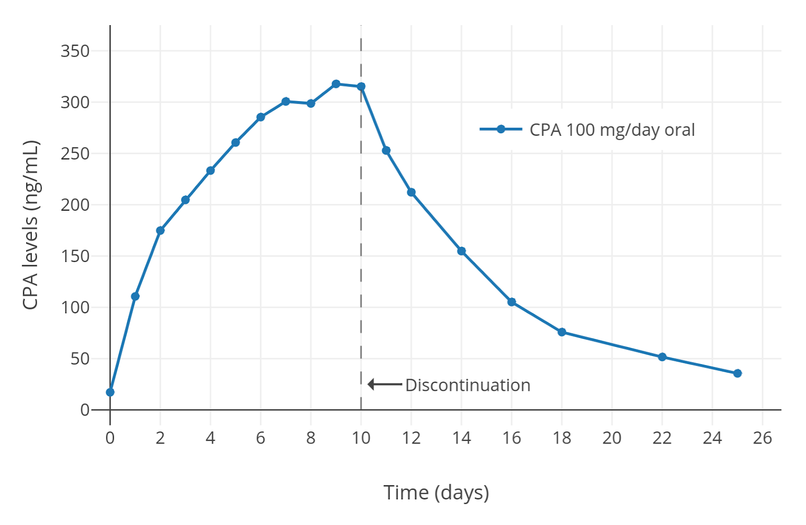
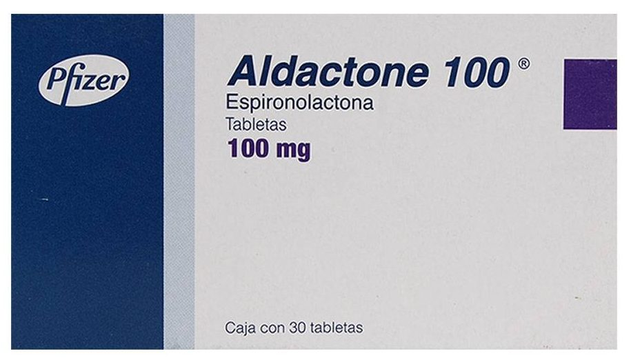
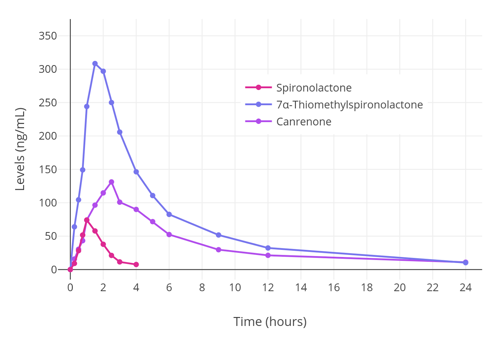
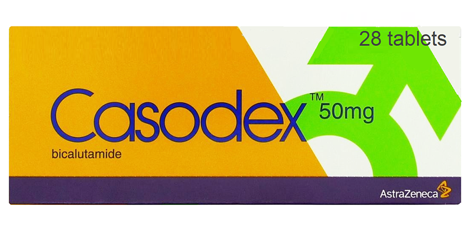
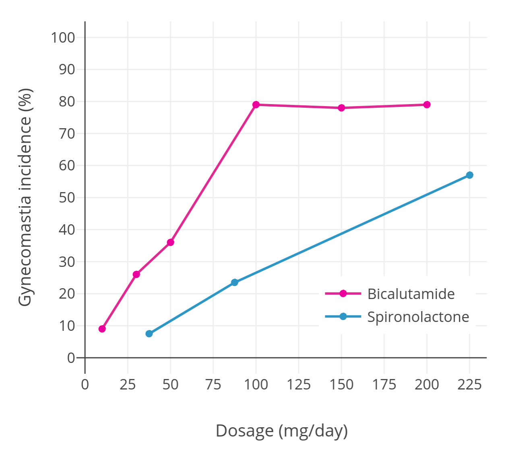
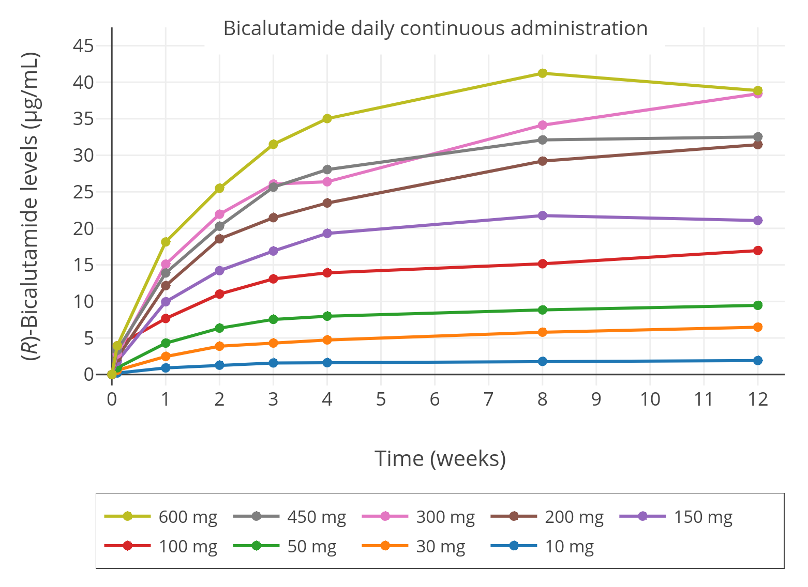

# Part 8 抗雄激素药物 (Antiandrogens) 篇

## 抗雄激素药物 (Antiandrogens)

### 受体拮抗剂 (AR Antagonists)

#### 螺内酯 (Spironolactone)

- 甾体抗雄激素 (Steroidal antiandrogen)
- 保钾利尿药 (Potassium-sparing diuretics)

#### 比卡鲁胺 (Bicalutamide)

- 非甾体类抗雄激素 (Nonsteroidal antiandrogen)
- 沉默性受体拮抗剂 (Silent AR Antagonist)

### 抗促性腺激素 (Antigonadotropins)

#### 醋酸环丙孕酮 (CPA/Cyproterone Acetate)

- 甾体抗雄激素 (Steroidal antiandrogen)
- 黄体制剂 (Progestin)

### 5α-还原酶抑制剂 (5α-RIs)

#### 非那雄胺 (Finasteride)

#### 度他雄胺 (Dutasteride)

### 大致的排名 (Ranking, roughly)

安全性 (Safety)：比卡鲁胺 ≥ 螺内酯 >> CPA

效力、单药治疗 (Effectiveness Monotherapy)：CPA > 比卡鲁胺 >> 螺内酯

效力、与雌激素并用时 (Effectiveness w/Estrogens)：比卡鲁胺 > CPA >> 螺内酯

可忍受度 (Tolerability)：比卡鲁胺 >> 螺内酯 > CPA

价格 (Cost, Inexpensiveness/便宜)：CPA > 螺内酯 > 比卡鲁胺

注意：不包括 GnRH 类药物

## 醋酸环丙孕酮 (Cyproterone Acetate / CPA)

“色普龙”

Brand name: “Androcur”

仿制药： “Siterone” etc.

### 价格

约 US$0.16 ~ 0.30 /天 (12.5 mg 剂量) (￥ 30 ~ 60 /月)
【价格参考来自 HRT.Cafe】

外国药商一列：[HRT.Cafe (CPA)](https://hrt.cafe/cypro/)

## 醋酸环丙孕酮 / CPA

CPA 是一种黄体制剂(Progestin)和抗雄激素药物，在跨性别界内被常使用.这篇将为低剂量的使用做更深入的讲解.

### CPA 导致过量的孕激素作用

CPA 是个强效的孕激素，1 mg/天 剂量已具有女性排卵抑制作用，而子宫内膜转化剂量为 1–3 mg/天 ([Wiki-Table](https://en.wikipedia.org/wiki/Template:Oral_potencies_of_progestogens); [Endrikat et al., 2011](https://doi.org/10.1016/j.contraception.2011.04.009)).这 CPA 的剂量范围与绝 经前女性黄体期的正常黄体酮分泌 (15 ng/mL) 的孕激素作用相似.当作为孕激素药物使用时 (如：避孕药、更年期激素疗法)，它通常被配制为 1–2 mg/片 形式 ([Wiki](https://en.wikipedia.org/wiki/Cyproterone_acetate#Available_forms)).

与其孕激素作用相反，CPA 作为雄激素(AR)拮抗剂的作用非常弱.当作为抗雄激素使用时，一般在男性和女性中以 50–300 mg/天 剂量服用.50–300 mg/天 剂量 通常用于治疗雄激素依赖性的头发与皮肤问题 (如：女性痤疮与多毛症)，而 50–300 mg/天 剂量则用于男性的前列腺癌 (具体为 100–200 mg/天，与手术/药物去 势 联合使用、单药治疗的话为 200–300 mg/天) ([Wiki](https://en.wikipedia.org/wiki/Cyproterone_acetate#Medical_uses)).因此，CPA 一般配制为 50 或 100 mg 片剂作为治疗雄激素依赖性病症使用.

由于 CPA 作为孕激素比作为 AR 拮抗剂更加有效，所以当作为典型临床剂量抗雄激素药物使用时会导致非常过量的孕激素作用 ([Hammerstein et al., 1975](<https://doi.org/10.1016/0022-4731(75)90311-8>); [Hammerstein, 1990](https://doi.org/10.1007/978-3-642-74612-3_35); [Hammerstein, 1979](https://books.google.com/books?id=waMTAQAAMAAJ)).这剂量所导致的超过量孕激素作用可能是造成已知的不良影响和风险的原因，如：疲倦、抑郁症、体重增加、泌乳素水 平过高、良性脑肿瘤、血栓、心血管并发症 ([Wiki-Table](https://en.wikipedia.org/wiki/Template:Published_case_reports_of_cyproterone_acetate-associated_meningioma); [Wiki-Table](https://en.wikipedia.org/wiki/Template:Published_case_reports_of_cyproterone_acetate-associated_meningioma)).这些风险都是剂量依赖性的，与 1–2 mg/天 剂量 CPA 使用无关 (除了避孕药组合里含有的 炔雌醇所带来的血栓风险之外) .CPA 的肝毒性风险也是剂量依赖性的，肝酶升高只在 20 mg/天 以上的剂量才会发生，罕见的肝衰竭病例几乎只在 100 mg/天 剂量以上才会发生 ([Wiki](https://en.wikipedia.org/wiki/Side_effects_of_cyproterone_acetate#Liver_toxicity); [Wiki-Table](https://en.wikipedia.org/wiki/Template:Published_case_reports_of_cyproterone_acetate-associated_liver_toxicity)).因此有充分的理由使用尽可能最低的 CPA 有效剂量，以大幅地降低风险.

在跨性别女性中，CPA 历来都是以每天 50–100 mg 剂量使用.然而内分泌学会在 2017 年发布了最新版本的跨性别 HRT 指南，并将其建议的 CPA 剂量从 50–100 mg/天 降低至 25–50 mg/天 ([Hembree et al., 2017](https://doi.org/10.1210/jc.2017-01658); [Hembree et al., 2009](https://doi.org/10.1210/jc.2009-0345)).这可能是因为他们对于此问题的认识，但是内分泌学会最新的推荐剂量可能还是远超 过实际需要使用的剂量.

## 低剂量与高剂量 —— 睾酮抑制能力的差别

孕激素本身，包括 CPA，都能有效地抑制睾酮水平.从 70–80 年代的研究发现，在健康男性中，每天 5–10 mg 剂量成功地抑制睾酮水平约 40%–70% ([Table of studies](https://docs.google.com/document/d/1iSmshUHbkNSshDAuGIxwkMjEwojYg55jPt1g7nG0g7M/view)).几项研究报告(individual studies)表示 5 mg vs 10 mg 剂量所达到的睾酮抑制作用几乎相同 (两方都约~50%抑制; [Wiki-Graph](https://commons.wikimedia.org/wiki/File:Testosterone_levels_with_5_or_10_mg_per_day_oral_cyproterone_acetate_in_men.png))，10 mg vs 20mg 也是几乎相同 (两方都约~60–70%抑制; [Wiki-Graph](https://commons.wikimedia.org/wiki/File:Androgen_levels_with_10_or_20_mg_per_day_oral_cyproterone_acetate_in_men.png)).在研究之间对比的两种剂量 (5–10mg；10–20 mg) 所缺乏额 外的睾酮抑制可能证实了 CPA 在 5–10 mg/天的剂量下实际上已可能达最大值.现代 2002 年的一项研究使用了一种更先进可靠的分析方式对 血液中的睾酮进行定量分析，发现 10 mg/天剂量 CPA 可使睾酮水平降低约 66%，从约 600 ± 150 ng/dL 下降至 ~185 ng/dL ([Meriggiola et al.,2002a](https://doi.org/10.1210/jcem.87.5.8514)).

其他孕激素的研究 (如：[去氧孕烯/desogestrel](https://en.wikipedia.org/wiki/Desogestrel)、[地诺孕素/dienogest](https://en.wikipedia.org/wiki/Dienogest)、[醋酸甲羟孕酮/MPA](https://en.wikipedia.org/wiki/Medroxyprogesterone_acetate)) 发现最大程度的睾酮抑制所需剂量为抑制女性排卵 剂量的 5–10 倍.基于 CPA 抑制排卵所需剂量为 1 mg/天，这意味着在 5–10 mg 剂量下，CPA 的睾酮抑制作用可能已经达接近最大值.

使用比较高剂量的 CPA 发现在睾酮抑制作用上似乎得到些许增加.现代研究发现对健康年轻成人和跨性别女性只使用 50–100 mg/天的 CPA 剂量可抑制 46–61%睾酮水平 (在 4–12 个月内，从 456–602 ng/dL 降低至 226–294 ng/dL) ([Toorians et al., 2003](https://doi.org/10.1210/jc.2003-030520); [Giltay et al., 2004](https://doi.org/10.1093/ajcn/80.5.1167); [T’Sjoen et al., 2005; Tack et al., 2017](https://doi.org/10.1677/joe.1.06112)).而先前关于高龄患者的前列腺癌治疗的研究发现更强的睾酮抑制作用，使用 CPA 单药治疗达到 70–80% (睾酮水平下 降至约 50–200 ng/dL) ([Gräf, Brotherton, & Neumann, 1974](https://doi.org/10.1007/978-3-642-80859-3_7); [Jacobi et al., 1980](https://doi.org/10.1111/j.1464-410X.1980.tb02961.x); [Wiki-Graph](https://commons.wikimedia.org/wiki/File:Testosterone_and_luteinizing_hormone_levels_with_100_mg_per_day_oral_cyproterone_acetate_in_men.png); [Knuth, Hano, & Nieschlag, 1984](https://doi.org/10.1210/jcem-59-5-963); [Wiki-Graph](https://commons.wikimedia.org/wiki/File:Testosterone_levels_with_300_mg_per_week_cyproterone_acetate_and_100_mg_per_month_estradiol_undecylate_by_intramuscular_injection.png); [Schröder & Radlmaier, 2002](https://doi.org/10.1007/978-1-59259-152-7_15); [Nelson, 2011](https://books.google.com/books?id=fu3BBwAAQBAJ&pg=PA2938)).在前列腺癌治疗研究里达到更高睾酮抑制的原因可能与研究之间的血液测试方法有关，和/或与老年男性的 HPG 轴较弱且睾酮激素水平较低有关 ([Liu, Takahashi, & Veldhuis, 2017](https://doi.org/10.1007/978-3-319-53298-1_16); [Winters, Wang, & Fortigel Study Group, 2010](https://doi.org/10.2164/jandrol.109.009035)).以上研究可能证实了 CPA 在一般情况下的睾酮抑制不超过 70%.

虽然孕激素(progestogens)可以在最大有效剂量下显著降低睾酮，但长期使用孕激素单药治疗后，可能会出现“复原”或“逃逸现象”，其睾酮 水平最终会恢复至较高的水平.被观察到最明显的相关孕激素是醋酸甲羟孕酮(MPA)，但也发现在 CPA 上 ([Goldenberg & Bruchovsky, 1991](https://pubmed.ncbi.nlm.nih.gov/1825143/);[Saborowski, 1988](https://scholar.google.com/scholar?as_sdt=1,5&q=author:%22KJ+saborowski%22&hl=en); [Jacobi, Tunn, & Senge, 1982](https://scholar.google.com/scholar?cluster=8992751753331497790)).在这些研究之中，最初睾酮水平被 CPA 抑制约 70%，但是在 6–12 个月内发现睾酮水平上升回 基线的约 50%，到 24 个月都保持同样水平.这现象只是在孕激素单药使用时才发现，孕激素和雌激素组合的使用并没有发现此现象.

## CPA 配合雌激素的使用 —— 睾酮抑制作用

在跨性别女性中，CPA 一般上与雌激素一同使用.雌激素与孕激素相似，都可以抑制睾酮水平.雌激素与孕激素的组合在睾酮抑制方面上具有协同作用，可达到比单使用雌激 素或孕激素时达到更强的睾酮水平抑制 ([Fink, 1979](https://doi.org/10.1146/annurev.ph.41.030179.003035); [Geller & Albert, 1983](https://www.ncbi.nlm.nih.gov/pubmed/6199846)).虽然雌激素本身能抑制睾酮到手术/药物去势水平 (睾丸切除术、GnRH 激动剂/拮抗剂)，但这必须 达到非常高的雌激素水平.约 200–300 pg/mL 雌二醇(E2)水平可将睾酮水平抑制约 90%，平均降低至~50 ng/dL；而约 500 pg/mL 的 E2 水平则可抑制 95%，平均降低至~15 ng/dL ([Wiki-Graph](https://en.wikipedia.org/wiki/Template:Antigonadotropic_effects_of_estradiol)).由于需要非常高的雌二醇水平来达到最大或接近最大值的睾酮抑制，一般上都会使用较低剂量的雌二醇与抗雄激素药物或孕激素一起使用，以抑制剩余的睾 酮水平.

2016 年的一项研究显示对跨性别女性使用 CPA 50mg/天+透皮雌二醇凝胶 1–2 mg/天 剂量达到的雌二醇(E2)水平为 45 pg/mL 不足以把睾酮抑制下女性标准值，睾酮水平为 120–190 ng/dL ([Gava et al., 2016](https://doi.org/10.1111/cen.13050); [Wiki-Graph](https://commons.wikimedia.org/wiki/File:Hormone_levels_with_low-dose_estradiol_gel_and_oral_cyproterone_acetate_in_transgender_women.png)).而相反的，85 pg/mL 的 E2 水平+CPA 则成功地把睾酮水平抑制下 20 ng/dL.因此，完全把睾酮水平抑制下女性值似乎需要一定水 平的雌二醇(E2).在一项 2019 年的研究中，CPA+口服戊酸雌二醇(EV)成功达到睾酮抑制所需要的雌二醇(E2)水平中间值为 76 pg/mL ([Angus et al., 2019](https://doi.org/10.1530/EC-19-0272); [Wiki-Graph](https://commons.wikimedia.org/wiki/File:Testosterone_levels_with_estradiol_alone,_estradiol_plus_spironolactone,_and_estradiol_plus_cyproterone_acetate_in_transfeminine_people.png)).

Fung et al. (2017) 的研究显示 25 或 50 mg/天 CPA 剂量，与中等剂量的口服雌二醇(~3.5mg/天)或透皮雌二醇(凝胶~3.5mg/天；贴剂~100μg/天)的结合使用可导致与女性雌二醇 水平同等的完全睾酮分泌抑制 (约 95%睾酮水平抑制) ([Fung, Hellstern-Layefsky, & Lega, 2017](https://doi.org/10.1080/15532739.2017.1290566)).一般上这剂量能达到的 E2 水平为 100 pg/mL 左右.这项研究在 2017 年版本的内 分泌学会指南 6 个月前发表.这可能是内分泌学会将指南内 CPA 推荐剂量的 50–100 mg 降低为 25–50mg 的原因.

虽然较少研究对低剂量 CPA 与中等剂量雌激素的联合使用的睾酮抑制作用做出评估.但由于 5–10 mg 似乎在睾酮抑制作用上已接近最高值，所以这剂量可能与更高剂量同样 有效.据此，一些研究使用 5–12.5 mg 的 CPA + 较高生理替代剂量的睾丸激素(T)，成功把促性腺激素(LH, FSH)降低至<0.5 IU/L 水平，从而完全抑制了健康年轻男性体内的睾 酮分泌功能 ([Meriggiola et al., 1998](https://doi.org/10.1093/humrep/13.5.1225); [Meriggiola et al., 2002b](https://doi.org/10.1002/j.1939-4640.2002.tb02311.x)).雌二醇是个比睾酮更要强力的抗促性腺激素，所以这些研究结果可能适用于雌二醇的生理替代水平 (如：平均 E2 水平的 100–200 pg/mL).

另外，[Meyer et al. (2020)](https://docdro.id/rYTjdbP) 评估了各种 CPA 剂量对 155 名跨性别女性，发现使用了 10 、 25 、或 50 mg/天 CPA 剂量的睾酮水平没有变化.睾酮水平在这 3 个剂量下都被强力地抑制 (至 15–20 ng/dL 平均，或女性水平范围的下限) .本研究使用的是口服 EV (中间值为 6 mg/天，范围为 3–10 mg/天) 、透皮雌二醇凝胶 (中间值为 2.25 mg/天，范围为 1.5–6 mg/天) 、以及透皮雌二醇贴剂 (100 μg/天)，而平均 E2 水平为 100 pg/mL.这研究证明了雌二醇水平如果足够，是不需要使用比 10 mg 更高剂量的 CPA 来完全抑制跨性别女性体内的睾 酮分泌的.另一项研究也发现在睾酮抑制能力上，<20mg/天 与 >50mg/天 剂量的 CPA 没有差异 ([Even-Zohar et al., 2020](https://doi.org/10.1210/jendso/bvaa046.1412)).

如果雌二醇(E2)水平够高的话，就算 5 mg/天 以下剂量也可能有效地抑制睾酮，虽然这较低剂量范围还未被证实/研究过.但这在其他孕激素的研究中有先例.其中一个例子为： 一项研究使用了 10 mg/天 的口服醋酸甲羟孕酮/MPA (MPA 在排卵抑制作用上与 1 mg 的 CPA 同等; [Wiki-Table](https://en.wikipedia.org/wiki/Template:Oral_potencies_of_progestogens)) 加入雌二醇与螺内酯治疗中，发现睾酮水平降低了 63% (215 ng/dL vs 79 ng/dL) ([Jain, Kwan, & Forcier, 2019](https://doi.org/10.1210/jc.2018-02253)).

## CPA 临床剂量范围 —— 第二抗雄机理

### CPA 高剂量 —— 雄激素受体拮抗作用 (AR antagonism)

CPA 的雄激素受体(AR)拮抗效力相对较弱，要产生有意义或较强的 AR 拮抗作用必须使用典型临床剂量的 50–300 mg/天.但不幸的是，这剂量范围会导致过量的孕激素作用， 并且造成相当大的风险与不良副作用.所以这种剂量的使用对于跨性别 HRT 是被认为非常不明智的.从理性角度来看，CPA 应该以较低的剂量作为一个孕激素来抑制睾酮，而 不是作为 AR 拮抗剂来使用.因此，CPA 的最高有效剂量 10–12.5mg/天 应该作为跨性别 HRT 的使用上限.

必须强调的是，由于 CPA 和雌激素的组合可以非常容易地抑制睾酮水平至女性/去势水平范围，AR 拮抗作用在大多数情况下是不必要的.但如果存在需要 AR 拮抗作用的时候 (如：治疗痤疮、把乳房发育潜力最大化、或其他目的)，可以导入低剂量的“非孕激素性”AR 拮抗剂 (如：比卡鲁胺 或 螺内酯) 来拮抗剩余女性范围的睾酮水平.CPA + 比卡鲁胺 或螺内酯的使用比单纯使用高剂量的 CPA 更安全.

## CPA 推荐剂量

|   形式    | 分配 |  最高剂量  |
| :-------: | :--: | :--------: |
| 10 mg/片  | ½ 片 |  10 mg/天  |
| 50 mg/片  | ¼ 片 | 12.5 mg/天 |
| 100 mg/片 | ¼ 片 | 25 mg/两天 |

补充：CPA 的半衰期 (Elimination half-life) 一般为 1.5–2 天 (但也 可能长达 4 天) .因此每隔一天服用一次，是有合理基础的.

## CPA 主要的副作用

### 肝脏毒性 (Liver Toxicity)

CPA 的肝毒性取决于剂量，风险从 3%开始(1–20 mg/day)上升至 20–30%(50–300 mg/day).但除了 1 个病例之外，肝损害与肝癌病例只在 100–300 mg/day 剂量范围观察 到.虽然已报道过几百个肝毒性的病例，但绝大多数的病例都是患有前列腺癌的老年男子.因此年龄与剂量似乎是主要造成肝毒性的首要原因.目前没观测到跨性别 女性中的肝损坏病例，但使用 CPA 时和口服雌激素的组合可能会稍微增加此风险.CPA 的肝毒性风险可以通过肝功能试验(Liver Function Tests)来确保肝酶维持在正 常水平.因此，肝功能检查是极力推荐的，尽管风险在 20 mg 剂量范围时可能较低.

### 血栓 (Blood Clots)

CPA 单独使用、或与雌激素同时使用时有需要注意的血栓风险.该风险可能与剂量有关，25–300 mg/天 剂量范围的血栓风险似乎非常相似，但在非常低的剂量时可 能会大幅降低 (2 mg 避孕药剂量) .尽管如此，即使低剂量也似乎明显地增加了血栓风险.血栓风险在特定个体上必须留意 (如：年龄、肥胖、吸烟、癌症、基因遗传、口 服雌激素或合成激素的高剂量使用) .在使用高剂量炔雌醇+CPA 的跨性别女性中，血栓发生率达到了惊人的 5%，特别是 40 岁以上高龄组(12%).非口服途径雌二醇与 更低剂量的 CPA 使用(~10mg/day)会降低此风险，但还是值得注意的.

### 脑瘤 (Brain Tumors)

CPA 有个严重的脑瘤风险——泌乳素瘤、脑膜瘤(Prolactinoma, Meningioma).已知的病例都是使用高剂量 CPA(50 mg–200 mg/天)、除了一个 2 mg/day 的病例 (这 病例使用了高量的雌激素) .泌乳素瘤的风险似乎强烈取决于 CPA 和雌激素的剂量，使用低剂量的 CPA 和雌激素可降低此风险.泌乳素瘤一般于 6 个月–15 年来成长.泌 乳素瘤能造成中枢神经系统问题，也可能会需要手术.在任何状况之下，这风险在~10 mg/天 剂量左右可能相对较低.

脑膜瘤(Meningioma)的病例比起泌乳素瘤病例较多 (50 个病例) .与泌乳素瘤相反，这些病例所使用的剂量范围较广，从 10 mg 到 200 mg/天都有，而且有相当数量的 病例来自于 10mg–25 mg/天 剂量.雌激素造成脑膜瘤的风险较低，并且相当多的病例来自于 CPA 的服用.虽然脑膜瘤的病例比泌乳素瘤较多，一项对 2500 个跨性别女 性的研究所显示的风险几率为 1/320 (0.31%).虽然脑膜瘤

### 糖皮质激素作用 (Glucocorticoid Effects)

CPA 的糖皮质激素作用非常弱，主要在高剂量(200 mg–300 mg/天)可能会降低促肾上腺皮质激素(ACTH)，在突然戒断时可能会导致肾上腺皮质功能不全(adrenal insufficiency).虽然在 50 mg 以下剂量这不常见，但使用 50mg 剂量时戒断前不妨可以选择每隔一、两周降低剂量. 由于其 CPA 的睾酮抑制能力较强，并且在临床上高剂量拥有微弱的受体拮抗作用，如果长期服用后突然戒断可能会导致雄激素反扑作用，在这基础上可以考虑在戒 断之前花时间缓慢地降低剂量.

### 抑郁症、维生素 B12 缺乏症、疲倦 (Depression, B12 Deficiency, Fatigue)

目前对 CPA 本身所引发的抑郁症相关研究的样本数量以及质量不足，所以不能极力认为 CPA 是造成抑郁等情绪问题的主要原因. CPA 有可能在 50 mg 剂量以上会造成 B12 缺乏，对于 CPA 造成 B12 缺乏症的严重度有必要再进行更多的研究来断定.缺乏 B12 可能与抑郁、情绪问题等有关联. 以上两项副作用与疲倦等有可能是性激素 (睾酮/ 雌二醇) 低下间接造成的，而并非 CPA 本身所导致的副作用.

## CPA 血药浓度

每天服用 100 mg CPA 女性体内药物浓度水平，服用在第十天停止. ([Neumann & Wiechert, 1988](https://doi.org/10.1002%2Fpauz.19880170202); [Hammerstein et al., 1983](https://doi.org/10.1016%2F0022-4731%2883%2990223-6); [Hammerstein, 1990](https://doi.org/10.1007%2F978-3-642-74612-3_35))

## CPA —— 血液检查项目、建议与结论

### 血液检查 (Blood Test)

- 肝功能试验 (Liver Function Test / LFT) ○ AST、ALT、胆红素 (Bilirubin)
- 血常规 (全血细胞计数) (Full Blood Count / FBC / Complete Blood Count / CBC)
- 泌乳素 (Prolactin / PRL) \*\*
- 雌二醇 (E2)
- 睾酮 (Testosterone)
- 维生素 B12 (Vit B12)、叶酸 (Folate) = 贫血检测 (Anemia Profile) _特别情况下_

### 药代动力学 (Pharmacokinetics)

- 口服生物利用度 (Oral Bioavailability)
  - 68 – 100%
- 生物半衰期 (Elimination Half-life)
  - 1.5 – 2 天 (最高 4 天)
- 达稳态血药浓度所需时间 (Time to steady-state / Tss)
  - ~8 天
- 稳态血药浓度 (Steady-state levels / Css)
  - 2 – 3 倍

### CPA 建议

- CPA 应该只在低剂量范围使用 (5~12.5mg/day)
- CPA 应该作为一个短期药物使用 (5 年以下)
- 尽可能选择使用其他抗雄激素疗法 (比卡鲁胺、螺内 酯、雌二醇单药疗法、睾丸切除术、雌二醇+直肠黄体 酮)
- 不应该在高龄组中使用 (>50 岁)
- 不应该对家属内患有过脑膜瘤病史的人使用
- CPA 的使用应该尽可能地在医生的监督下使用或定期 地进行 MRI 等等.

### 结论

高剂量 CPA 与口服/合成/高剂量雌激素一同使用，在某些高风险的个 体上可能会造成危险的不良反应.但是这些副作用和风险在低剂量能 够大幅地降低.同时，由于 CPA 的睾酮抑制能力被观测为可能在 5–10mg/天 剂量时已经接近或抵达最大值，高剂量 CPA 的使用是不必 要的.如果某些情况下需要雄激素受体拮抗能力(AR Antagonism)，强 力推荐在服用低剂量 CPA(12.5mg/天)的情况下加入低剂量的受体拮 抗剂 (如：螺内酯、比卡鲁胺)，或完全转用受体拮抗剂.至于抑郁、B12 缺乏等副作用在使用低剂量的时候不常见，CPA 剂量极力推荐为 12.5mg/天.

## 螺内酯 (Spironolactone)

Brand name: “Aldactone”

仿制药： “Hyles”, “Spiractin” etc.

### 价格

约 US$0.23 ~ 0.5 /天 (100 mg 剂量) (￥ 45 ~ 100 /月) 【价格参考来自 HRT.Cafe】

外国药商一列：[HRT.Cafe (Spironolactone)](https://hrt.cafe/spironolactone/)

## 螺内酯

螺内酯是一种抗雄激素药物、也是个弱效的雄激素合成抑制剂(Androgen Synthesis Inhibitor).在 Trans 医学文献、跨性别界内广泛流传着一个对于螺内酯错误的认识 —— 螺内酯能抑制睾酮分泌/降低睾酮水平，而这是螺内酯的抗雄激素机理.

但从各种医学文献上来看，其实有大量数据能证明事实与该认识完全相反.从 1970 到 2019 有大量研究数据评估了螺内酯对睾酮水平的影响，并发现关于螺内酯是否会 影响睾酮水平的证据不足 (Mixed Evidence).

支持这个文章的一系列研究报告：[[WIP Table of Documents](https://docs.google.com/document/d/1fphyAZ5-zWNseiLv9r2W3VVubygp102cQ8--TtcWgr0/view)]

共 26 项研究(individual studies)显示， 15 项研究(58%)发现睾酮水平没变化； 6 项研究(23%)发现睾酮水平降低；而 4 项研究(15%)无法得出任何结论.这些研究大多数都属 于小规模研究，而近年来对跨性别女性的研究是属于较大规模的. 在这些研究中，即使长期使用非常高剂量的螺内酯所得到的结论也是如此.其中一项研究使用了 400mg/天 螺内酯剂量长达 6 个月，在年轻男性上发现促性腺激素 (gonadotropins)、睾酮(T)、与雌二醇(E2)水平上没变化.然而，近年来有两项研究发现相反的结果——这两项研究使用了雌二醇 + 螺内酯的组合，发现明显的睾酮水平 减少 ([Cheung et al., 2018](http://esa-srb-2017.p.asnevents.com.au/days/2017-08-28/abstract/45224); [Angus et al., 2019](https://ec.bioscientifica.com/view/journals/ec/8/7/EC-19-0272.xml)).造成这些研究差异的原因目前还不清楚.

事实上睾酮值大多数情况不被螺内酯影响，这些研究结果表明了螺内酯可能是个具有在临床意义上的睾丸激素合成抑制剂(Testosterone Synthesis Inhibitor)，但也只 不过是个对睾丸激素带来效果极弱且效果不一致的药物.无论如何，即使在近年的研究中发现的矛盾也可能需要执行更好的研究设计与更多的研究来达到结论.

### 螺内酯抗雄机理

螺内酯主要是个雄激素受体拮抗剂(AR antagonist)，生物目标为睾酮、双氢睾酮(DHT) 等雄激素.通过拮抗受体来降低雄激素的生理活性.这效果比 CPA 强但劣于比卡鲁胺， 因此一般上比较适用于拮抗标准女性值的睾酮水平 (<100 ng/dL). 由于螺内酯的抗雄效力较弱，一般要达到较有意义的抗雄作用所需的剂量将会比较高 ，但这也会造成不良副作用.

### 螺内酯推荐剂量

|        推荐剂量         |  <100 mg/天   |
| :---------------------: | :-----------: |
| 内分泌学会指南推荐 剂量 | 100–200 mg/天 |
|   高剂量上限 (不推荐)   | 200–400 mg/天 |

由于螺内酯的半衰期较短，建议每日服用两次 (b.i.d)

## 螺内酯主要的副作用

### 高钾血症 (Hyperkalemia)

螺内酯最罕见、严重的风险是高钾血症，在某些情况下可能会致命.患有心脏病的人使用此药可导致高钾血症发生率增加至 10–15%、高剂 量的话可达 24%.这风险在高龄组或肾功能不全个体中会大幅增加.由于此药的利尿性把钾存留在体内，如果在服药期间同时服用其他保钾 药物、食用过量含有高钾的食物可能会导致体内钾量的累积.此药也可能对患有肠胃问题的人造成不适感.

高钾症状如：

- 肌肉痉挛
- 作呕
- 心律失常
- 感觉异常 (Paresthesia)

这风险取决于剂量，一般情况下适量的使用 (~100mg/day) 不会带来任何严重的副作用与症状.然而有些研究表示高钾血症风险在健康肾功 能人群内也可能发生，所以高剂量的使用在安全性上可能需要定时地检验肾功能.

### 低钠血症 (Hyponatremia)、低血压 (Hypotension)

螺内酯可能会引起低血钠或轻度缺钠，身体可能会渴望盐分 (副作用).

螺内酯一般用来治疗高血压 (剂量于 40–80mg)，所以有降低血压的作用，已患有低血压的话在使用此药时请注意.

### 药物相互作用 (Drug Interactions)

服用螺内酯时需要注意的药物，与以下药物一同使用可能会增加螺内酯的副作用和风险：

- 血管紧张素转换酶抑制剂 (ACE Inhibitors)
  - 高钾血症风险会提高
- 血管紧张素 II 受体拮抗剂 (ARB)
- 非甾体类消炎镇痛药 (NSAIDs)
  - 如：吲哚美辛、布洛芬
- 钾补充剂
- 任何具有肾毒性药物

### 主要副作用

- 尿频
- 脱水 (Dehydration)
- 低钠血症 (Hyponatremia)
- 轻度低血压 (Mild Hypotension)
- 高钾血症 (Hyperkalemia)

## 排除半衰期 (Elimination Half-life)

螺内酯进入体内后 80%由肝脏迅速代谢为有活性的坎利酮(Canrenone)

图表：服用 100mg 后，螺内酯与其代谢产物的水平 ([Jankowski et al., 1996](https://doi.org/10.1016%2FS0731-7085%2896%2901767-0))

## 螺内酯 —— 血液检查项目、建议与结论

### 血液检查 (Blood Test)

- 肾功能试验 (Renal Function Test / RFT)
  - 钾 (Potassium)、钠 (Sodium)
- 血常规 (全血细胞计数) (Full Blood Count / FBC / Complete Blood Count / CBC)
- 肝功能试验 (Liver Function Test / LFT)
- 雌二醇 (E2)
- 睾酮 (Testosterone)
- 黄体生成素 (LH)

### 药代动力学 (Pharmacokinetics)

- 口服生物利用度 (Oral Bioavailability)
  - 60 ~ 90%
- 生物半衰期 (Elimination Half-life) (Graph)
  - 螺内酯：1.4 小时
  - 7α-TMS：13.8 小时
  - 6β-OH-7α-TMS： 15 小时
  - 坎利酮 (Canrenone)：16.5 小时
- 达稳态血药浓度所需时间 (Time to steady-state / Tss)
  - 8 ~ 10 天

### 结论

螺内酯是一种主要用来治疗心衰、体液潴留、高血压的利尿药，但因其副作用会对跨性别女性所需的女性化目的有 利，而且也不是非常的危险，所以被内分泌学会指定为合格的抗雄激素药物.

根据现有的研究结果来看，螺内酯似乎在大多数情况下不会降低体内睾酮水平，而是主要作为一个受体拮抗剂来 作用.在这方面，除了此药的抗盐皮质激素作用(antimineralocorticoid)以及其他的激素作用外，螺内酯与比卡鲁胺这 种受体抗结剂相似.由于螺内酯的受体拮抗作用比较弱，一般上如果要拮抗较高水平的睾酮可能会需要使用较高的 剂量(>200 mg)，但这也会提高此药带来的副作用和风险.

在非常多的情况下，使用螺内酯+雌二醇组合的 HRT 所导致的睾酮抑制一般来自于雌二醇本身.螺内酯能拮抗的睾 酮一般为女性水平 <80 ng/dl. 所以推荐使用血液报告来判断或调整螺内酯的剂量来拮抗剩下雌二醇所抑制不了的睾酮.

在效力方面上，螺内酯作为一个抗雄药物可能不是非常理想的选择.

## 比卡鲁胺 (Bicalutamide)

Brand name: “Casodex”

仿制药： “Calutide”, “Binarex”, “Procalut”, “Bicana”, “Bicalutamide Canon” etc.

### 价格

约 US$0.5 ~ 1 /天 (50mg 剂量) (￥ 100 ~ 200 /月) 【价格参考来自 HRT.Cafe】

外国药商一列：[HRT.Cafe (Bicalutamide)](https://hrt.cafe/bicalutamide/)

## 比卡鲁胺

比卡鲁胺属于非甾体类抗雄激素药物 (Nonsteroidal antiandrogen)，是一种强力的选择性雄激素受体拮抗剂 (Selective Androgen Receptor Antagonist). 它与其他甾体类抗雄药物不同，完全没有任何脱靶激素作用.同时，比卡鲁胺属于沉默性受体拮抗剂 (Silent AR antagonist)，所以没有任何受体激动能力.

比卡鲁胺专为治疗前列腺癌而开发，在 1995 年首次投入.与其他抗雄激素药物(CPA、螺内酯)相比，在效力、选择性、可忍受度(effectiveness, selectivity, tolerability)上 有绝对的优势.由于多年来药品专利保护使此药非常贵，比卡鲁胺的使用在一般跨性别 HRT 中还比较少见.但从 2007~2009 年时期，比卡鲁胺的仿制药开始发售，而新 一代更强的抗雄药物 (恩杂鲁胺) 也在 2012 年被投入前列腺癌治疗中，这使得比卡鲁胺的价格大幅降低.

### 比卡鲁胺抗雄机理

图 1 AR antagonism of Bicalutamide roughly illustrated

比卡鲁胺活动在雄激素受体处，直接与雄激素 (如：睾酮、DHT) 竞争.它能阻止雄激素与受体结合，防止雄激 素激动受体，从而完全去除雄激素活性. (图 1 )

比卡鲁胺不存在任何雄激素抑制能力，它没有任何抗促性腺激素作用以及雄激素合成抑制作用，只靠在受体 处阻碍雄激素来达到抗雄目的.

比卡鲁胺不会抑制雄激素，反而会提高雄激素的分泌 (当作为单一疗法药物使用时 / Monotherapy). 这是因为雄激素受体处发生的阻滞，使 HPG 轴上丧失了雄激素带来的负反馈 (negative feedback)； 导致雄激素受体信号下降(low AR signaling)，导致体内上调睾酮分泌.

由于它的高选择性，比卡鲁胺一般上不会与其他类固醇激素受体有任何互动，因此不具有其他脱靶激素作用 (off-target hormonal activity).

## 比卡鲁胺 —— 副作用

比卡鲁胺在女性中基本上没有副作用 ([Müderris et al., 2002](https://www.tandfonline.com/doi/abs/10.1080/gye.16.1.63.66); [Moretti et al., 2018](https://academic.oup.com/jcem/article/103/3/824/4677371)).但是，它被观测在少数使用者身上产生异常的肝功能试验结果 (肝毒性前兆) 、 肺毒性.肝与肺毒性在某些情况下可能致命，这导致了将比卡鲁胺导入跨性别 HRT 治疗中的延迟.由于存在以上的罕见的风险，使用比卡鲁胺时必须意识到这点 并进行适当的检查.

### 肝脏毒性 (Liver toxicity)

在一项非常大型的 III 期 RCT 中 (n ≈ 8,000 total) ([Wiki-Table](https://en.wikipedia.org/wiki/Template:Side_effects_of_bicalutamide_monotherapy))——患有早期前列腺癌的老年男性中，150mg/day 剂量的使用与肝酶升上有关——为 3.4%，相比对照组的 1.9% (比卡 鲁胺导致 1.5%的显着性差异).

另一项 III 期 RCT 中 ([Wiki-Table](https://en.wikipedia.org/wiki/Template:Side_effects_of_combined_androgen_blockade_with_nonsteroidal_antiandrogens))——患有晚期前列腺癌的老年男性中，50mg/day 比卡鲁胺+GnRH 激动剂的使用造成 7.5%肝酶升上、显著性升上 0.5% (这一组为 n ≈ 400) .这研究 没有使用无效对照组(placebo)；反而对照组使用了 750mg/day 氟他胺+GnRH 激动剂，这组肝酶升上观测为 11.3%、显著性升上 2.5% (这组也为 n ≈ 400). 几项已发布的关于比卡鲁胺造成肝毒性的病例报告，有两项造成致命结果 ([Wiki-Table](https://en.wikipedia.org/wiki/Template:Published_case_reports_of_bicalutamide-associated_liver_injury)).而在临床上造成肝毒性的剂量为 50mg~150mg/day，没有明确的剂量依赖性，病发时间为 两天 – 4.5 个月.

目前在大约 8000 名男性中没观测到临床上比卡鲁胺造成严重的肝毒性或肝衰竭 ([Blackledge, 1996](https://doi.org/10.1159/000473847); [Kolvenbag & Blackledge, 1996](<https://doi.org/10.1016/S0090-4295(96)80012-4>); [McLeod, 1997](https://doi.org/10.1634/theoncologist.2-1-18); [Anderson, 2003](https://doi.org/10.1046/j.1464-410X.2003.04026.x); [Iversen et al., 2004](https://doi.org/10.1097/01.ju.0000139719.99825.54)).氟他胺的肝毒性风险预测为~0.03% (FDA’s MedWatch/FAERS database).比卡鲁胺被认为比氟他胺具有更低的肝毒性.

由于比卡鲁胺存在此风险，肝功能检查必须定时进行.如果肝酶大量升高，必须立刻停止使用 (或调低剂量) .由于大多数的病例都是在治疗的早期阶段发生 (前 6 个月内)，这段 时间必须留意观察肝功能.

### 肺毒性 (Lung toxicity)

比卡鲁胺曾被报道为与间接性肺炎有关，可导致肺纤维化、和嗜酸性细胞性肺炎 ([Wiki](https://en.wikipedia.org/wiki/Side_effects_of_bicalutamide#Lung_toxicity)).存在数个已发表的间质性肺炎和嗜酸性细胞性肺炎与比卡鲁胺有关的病例报告，有少数为致命的([Wiki-Table](https://en.wikipedia.org/wiki/Template:Published_case_reports_of_bicalutamide-associated_lung_toxicity)).造成的剂量为 50~200mg/day、病发时间为两周–6 年，大部分为第一年发病.一项使用 FDA's MedWatch/FAERS 数据的研究估计使用比卡鲁胺造成间接性肺炎的几率为 0.01% (1 in 10,000) ([Bennett, Raisch, & Sartor, 2002](https://doi.org/10.7326%2F0003-4819-137-7-200210010-00029)).但这也可能存在 FDA 漏报以及其他的因素 ([Ahmad & Graham, 2003](https://www.acpjournals.org/doi/10.7326/0003-4819-139-6-200309160-00023)).这目前是被视为比卡鲁胺极度罕见的一个风险.

## 比卡鲁胺单药治疗最大的副作用——乳房发育 (Gynecomastia)

造成男性乳房发育的机理主要为两点：

1. 乳房组织内的雄激素信号
2. 体内雌激素水平/浓度

雌激素是造成一般上乳房发育的因素，雄激素则强力地抑制乳房发育.在雌激素浓度较低的 情况下如果没有或只是低下的雄激素信号是足够刺激乳房发育的.

比卡鲁胺单药治疗(Bicalutamide Monotherapy)造成的乳房发育比较常见.由于比卡鲁胺不会 抑制睾酮分泌，反而会提高睾酮分泌量，这使睾酮由芳香酶转化为雌二醇(Aromatization).在 治疗患有前列腺癌男性的剂量研究之间发现乳房疼痛感与乳房发育率高达 80% (100 mg/day) ，再高的剂量并没有持续提高这效果.

剂量研究发现比卡鲁胺造成乳房发育的几率为：9% (10 mg/day)，26% (30 mg/day)，36% (50 mg/day)，79% (100 mg/day)，78% (150 mg/day)，79% (200 mg/day) ——[Wiki-Table](https://en.wikipedia.org/wiki/Template:Bicalutamide_monotherapy_and_breast_side_effects_in_dose-ranging_studies_in_men).比卡鲁胺 单药治疗使这些男性体内的睾酮上升至 400–600 ng/dL、平均约 500 ng/dL，并且基本上与剂 量无关.

比卡鲁胺造成的乳房发育率比螺内酯高.(图 1)

比卡鲁胺造成的乳房发育率比螺内酯高.(图 1)

## 比卡鲁胺使用剂量

比卡鲁胺不会抑制/降低雄激素，而只靠拮抗雄激素受体(AR)来发挥作用，所以此药的有效剂量完全取决于体内雄激素水平.

[Gooren (2011)](http://doi.org/10.1056/NEJMcp1008161)、[Randolph (2018)](http://doi.org/10.1097/GRF.0000000000000396) 推荐在跨性别女性中使用 50 mg/day，配合雌激素所带来的睾酮抑制来有效地消除雄激素活性. [Fishman et al. (2019)](https://doi.org/10.1007/978-3-030-05683-4_8) 则推荐 25–50mg/day 剂量.

另外，Neyman, Fuqua, and Eugster (2019) 使用 50 mg/day 单药治疗在跨性别女性中作为发育阻滞剂(Puberty blocker)来使用.虽然这剂量在临床上单药治疗中能刺激乳房 发育和女性化，此低剂量在单药治疗中可能不会完全避免雄激素为身体带来的影响.这是因为比卡鲁胺单药治疗会造成睾酮水平的上升 (数据图表 1 ; 数据图表 2 ).

用于治疗女性中多毛症的剂量为 25 mg/day.这通常与含炔雌醇(EE)的避孕药同时使用，可降低血清睾酮水平、并使游离睾酮水平(Free Testosterone)降低 40–80% (通过 SHBG 水平的上升) .在绝经前的女性中血清睾酮水平为 5–45 ng/dL (平均为 30 ng/dL)，而游离睾酮为男性的~50% (由于绝经前女性 ~2 倍高的 SHBG) .因此，血清睾酮水 平在绝经前女性一般低于男性平均水平的 20 倍、游离睾酮则为 40 倍.于是，更低剂量比卡鲁胺能带来的抗雄效果能在女性中使用，这包括顺性别女性与跨性别女性 (睾 酮水平已经被雌激素降低的个体).

根据参考全部现有的临床研究，我们能大约把使用剂量定为 6.25–50mg/day，适用于睾酮已经被抑制到一定水平下的情况 (约 <200–300 ng/dL). 而更高剂量 150–300mg/day 可作为单药治疗，在睾酮没被抑制下的情况使用 (约 >600 ng/dL).

|   形式    | 可拮抗的睾酮水平 |  推荐剂量   |
| :-------: | :--------------: | :---------: |
| 50 mg/片  |    <100 ng/dL    |  25 mg/天   |
| 50 mg/片  |  <200–300 ng/dL  |  50 mg/天   |
| 150 mg/片 |  <200–300 ng/dL  | 150 mg/3 天 |
| 150 mg/片 |    <600 ng/dL    |  150 mg/天  |

## 比卡鲁胺稳态血药浓度

|                              |         50mg/day         |             150mg/day              |
| :--------------------------: | :----------------------: | :--------------------------------: |
|       Cmax (峰值浓度)        | 0.77 μg/mL (1.8 μmol/L)  |       1.4 μg/mL (3.3 μmol/L)       |
|  Tmax (达峰值浓度所需时间)   |         31 小时          |              39 小时               |
|      Css (稳态血药浓度)      | 8.85 μg/mL (20.6 μmol/L) | 21.6-28.5 μg/mL (50.2-66.3 μmol/L) |
| tss (达稳态血药浓度所需时间) |         4–12 周          |              4–12 周               |

Graph：比卡鲁胺的血药浓度在起初时非常迅速地增加，达~50%的时间为一周，达~90% 所需时间为四周；后期则缓慢地增加，从 90%~100%所需时间为 4–12 周. ([Tyrrell et al., 1998](https://doi.org/10.1159%2F000019526); [Tyrrell et al., 2006](https://doi.org/10.1111%2Fj.1464-410X.2006.06275.x); [Cockshott, 2004](https://doi.org/10.2165%2F00003088-200443130-00003))

## 比卡鲁胺 —— 单药治疗的抗雄激素作用

|                   |  10 mg  |  30 mg  |  50 mg  | 100 mg  | 150 mg  |  200 mg  |
| :---------------: | :-----: | :-----: | :-----: | :-----: | :-----: | :------: |
|      LH 水平      | +40–64% | +34–41% | +52–69% | +71–88% | +83–97% | +79–105% |
|     睾酮水平      | +21–29% | +55–73% | +46–62% | +45–55% | +60–70% | +64–73%  |
|      E2 水平      | +17–36% | +20–32% | +47–65% | +54–84% | +48–61% | +52–63%  |
|     PSA 降低      |   57%   |   73%   |   90%   |   93%   |   82%   |   95%    |
| 前列腺癌的改善(A) |   63%   |   79%   |   85%   |   96%   |   98%   |   100%   |
|     乳房发育      |   9%    |   26%   |   36%   |   79%   |   78%   |   79%    |
|    乳房压痛感     |   11%   |   42%   |   48%   |   86%   |   89%   |   79%    |

A. Percentage with partial regression or stable disease instead of objective progression.

图 1：比卡鲁胺抗雄激素作用 ——剂量范围研究 ([Tyrrell et al., 1998](https://doi.org/10.1159/000019526))
| | 300 mg | 450 mg | 600 mg | 去势 |
| :---------------: | :-----: | :-----: | :-----: | :-----: |
| LH 水平 | +40–64% | +34–41% | +52–69% | - |
| 睾酮水平 | +21–29% | +55–73% | +46–62% | –95–96% |
| E2 水平 | +17–36% | +20–32% | +47–65% | –33–44% |
| PSA 降低 | 57% | 73% | 90% | 95% |
| 前列腺癌的改善(A) | 63% | 79% | 85% | - |

A. Percentage with partial regression or stable disease instead of objective progression.

图 2：比卡鲁胺抗雄激素作用 ——高剂量研究 ([Tyrrell et al., 2006](https://doi.org/10.1111/j.1464-410X.2006.06275.x))

## 比卡鲁胺 —— 血液检查项目

### 血液检查 (Blood Test)

- 血常规 (全血细胞计数) (Full Blood Count / FBC / Complete Blood Count / CBC)
- 肝功能试验 (Liver Function Test / LFT)
- 雌二醇 (E2)
- 睾酮 (Testosterone)

### 药代动力学 (Pharmacokinetics)

- 口服生物利用度 (Oral Bioavailability)

  - 吸收良好；绝对生物利用度不明

- 生物半衰期 (Elimination Half-life)
  - 单剂：5.8 天
  - 持续服用：7 – 10 天
- 达稳态血药浓度所需时间 (Time to steady-state / Tss)
  - 4 – 12 周

### 关于使用比卡鲁胺时，血清睾酮测试的重要性

由于比卡鲁胺完全不会抑制睾酮分泌，并且反而在没有睾酮抑制 (雌激素的使用) 的情况下单一服用会提 升睾酮分泌量，血清睾酮测试并不能作为用来评估比卡鲁胺抗雄作用的方法.但是，由于比卡鲁胺的抗雄 激素作用取决于体内循环睾酮水平，所以知道一个人的睾酮水平能更好的判断或调整正确的使用剂量.此 外，雌激素、孕激素、GnRH 受体激动剂等可以强力地抑制睾酮，所以血液检查同时也是为监测这类激素药 物效力的好方法，无论是否有在使用比卡鲁胺.

## 比卡鲁胺问答 (Q&A)

### Q1 比卡鲁胺是否比螺内酯或 CPA 具有更强的抗雄激素作用？

是的，但是完整的答案可能有些微妙.所有临床研究显示比卡鲁胺是比 CPA 更有效得多的雄激素受体拮抗剂 (AR 拮抗剂)，也同时是比螺内酯强力许多的 AR 拮抗 剂.螺内酯比较适用于拮抗女性睾酮水平(≤ 50 ng/dL)，比卡鲁胺则在足够的剂量上能有效地拮抗男性睾酮水平(>300 ng/dL).另一边，CPA 不止能够在受体处拮抗 雄激素，它也能够抑制性腺的睾酮分泌.事实上，CPA 的睾酮抑制也是跨性别女性使用的低剂量(12.5 mg)主要的抗雄激素作用.在睾酮抑制(Testosterone suppression)这方面上，CPA+雌激素的组合同时也可以称“CPA 是更强力的抗雄激素药物”.

### Q2 比卡鲁胺的药效持续多长时间？可以每几天服用一次吗？

比卡鲁胺有非常长的半衰期，单剂量(single dose)的半衰期为约 6 天、持续剂量服用(continuous dose)则为 7–10 天.简单来说，比卡鲁胺体内浓度下降一半需要花 6–10 天的时间.因此，比卡鲁胺不必每天服用，而可为每几天服用一次，或在某些情况下每周服用一次 (但是要注意比卡鲁胺的吸收在 200 mg 剂量以上不稳定 —— Graph) .如果服用频率少于一天一次的话，必须增加每次该摄入的剂量以补偿未服药天数的剂量，从而维持一周的总剂量 (以 50 mg/天 剂量来作为参考，每 周总剂量 = 350 mg).

### Q3 比卡鲁胺要花很长时间才开始作用吗？

由于比卡鲁胺很长的半衰期，在开始服用此药时它会在体内逐渐地积聚.比卡鲁胺稳态血药浓度在过了 4–12 周后不再增加.但是，血药浓度水平起初时非常迅速 地增加，后期则缓慢地增加.研究显示达 50%浓度只需一周，达 80%~90%却需要 3~4 周的持续服用 (详细看—稳态血药浓度).

### Q4 比卡鲁胺如何作用？能降低睾酮水平吗？

比卡鲁胺作为一种选择性雄激素受体(AR)拮抗剂来作用，它的主要拮抗的生物目标为像睾酮(Testosterone)、双氢睾酮(DHT)这类雄激素.比卡鲁胺直接在受体处 结合，从而置换掉雄激素，防止雄激素激活受体.比卡鲁胺与其他抗雄激素药物 (如：螺内酯、CPA) 不同，它不会与其他类固醇激素互动，使其成为更少副作用、 更安全的药物.同时也与其他抗雄激素药物相反，比卡鲁胺不会降低睾酮水平.

### Q5 比卡鲁胺能同时拮抗睾酮和双氢睾酮(DHT)吗？

是的.比卡鲁胺能同时拮抗睾酮与 DHT.这两者都是雄激素，所以都是同个生物目标(AR)的激动剂.DHT 是比睾酮强 2-3 倍的受体激动剂.比卡鲁胺能在受体处一同 拮抗睾酮与 DHT 来防止其造成活性.

### Q6 比卡鲁胺会导致睾酮水平上升或导致睾酮尖峰(Testosterone Spike)吗?

比卡鲁胺如果单一服用会引起男性体内睾酮水平上升.这是由于失去了受体处由雄激素为 HPG 轴带来的负反馈信号，从而造成体内尝试上调睾酮分泌来补偿雄 激素信号的低下.比卡鲁胺在单药治疗下高剂量使用会大量提升睾酮水平至 1.5 ~ 2 倍.在睾酮水平为 400 ng/dL 的前列腺癌男性患者中，比卡鲁胺单药治疗一般上 会把睾酮水平提升至大约 600 ng/dL.

比卡鲁胺所导致的睾酮水平升上不会发生在顺性别女性、睾丸切除后的男性、跨性别女性、GnRH 调节剂(GnRH modulator)使用者、或主要是服用适量雌激素/孕 激素的使用者身上.这是因为 GnRH 调节剂、雌激素、孕激素类都是抗促性腺激素，并能代替雄激素来维持 HPG 轴上的负反馈.由于一般跨性别女性都会服用雌激 素，比卡鲁胺导致的睾酮水平上升不会发生 (只需要少量的雌激素就能为 HPG 轴上带来负反馈) .比卡鲁胺不会影响肾上腺分泌的雄激素，无论性腺状态如何.

### Q7 比卡鲁胺能穿越血腦屏障(Blood-brain barrier)并阻断脑内的雄激素作用吗？

比卡鲁胺能穿越血脑屏障，进而抑制雄激素带来的心理/认知效果.同时也必须指出，比卡鲁胺的单药使用对性欲、性功能的影响微乎其微，但这并不是未能穿越 血脑屏障或拮抗脑内的雄激素失败的信号 (详细看——[Wiki: Distribution](https://en.wikipedia.org/wiki/Pharmacology_of_bicalutamide#Distribution)).

## 比卡鲁胺 —— 留意事项、结论

### 从 CPA 转用比卡鲁胺需留意的事项、戒断建议/指示

由于比卡鲁胺需要花 4 周达到 90%稳态血药浓度，所以建议正在使用 CPA 的跨性别女性在未戒断 CPA 的情况下开始服用比卡鲁胺 4 周后才戒断 CPA.这可以保护身体遭受戒断抗雄激素药物时的雄激素反扑作用.

注意：这是为了避免各位女性不想遭受各种雄激素反扑带来的风险的最好方法.由于比卡鲁胺为肝脏带来的损伤非常罕见，12.5mg 的 CPA 剂量 与 50mg 比卡鲁胺的并用一般上不会造成足量的肝脏负担.但是无论风险如何，最好在确保肝功能良好的情况下执行双药服用.如果要减少为肝 脏带来的负担，可以选择使用 25mg 剂量.

### 结论

比卡鲁胺是个强力且拥有高选择性的雄激素受体(AR)拮抗剂.由于其药性，在较 高的剂量下能有效地拮抗男性的睾酮水平.同时也由于其选择性，它没有其他的 激素作用，并且在女性中几乎没有副作用.而作为一种选择性 AR 拮抗剂，比卡鲁 胺不会抑制睾酮分泌.

比卡鲁胺与 CPA 相比有更低的肝毒性风险.在肝毒性上风险率比氟他胺更低，是 个较安全的 AR 拮抗剂.

## 关于比卡鲁胺作为跨性别女性 HRT 抗雄激素药物——已发布的所有文献 All Published Literature on Bicalutamide

WIP (可能以后整理完后再更新)

一项目前最主要关于比卡鲁胺作为 MtF HRT 抗雄激素药物使用的临床研究：

Neyman, A., Fuqua, J. S., & Eugster, E. A. (2019). Bicalutamide as an androgen blocker with secondary

effect of promoting feminization in male-to-female transgender adolescents. Journal of Adolescent

Health, 64 (4), 544–546. [DOI: [10.1016/j.jadohealth.2018.10.296](https://doi.org/10.1016/j.jadohealth.2018.10.296)]:

Purpose: The purpose of the study was to describe the novel use of bicalutamide in transgender youth.

Methods: This is a retrospective review of patients with gender dysphoria followed in the pediatric endocrine clinic at Riley

Hospital for Children.

Results: Of 104 patients with gender dysphoria, 23 male-to-female adolescents received bicalutamide 50 mg daily as a

second-line puberty blocker after insurance company denial of a gonadotropin-releasing hormone analog. Six patients received estrogen concurrently. Of 13 patients treated exclusively with bicalutamide seen in follow-up, 84.6% had breast

development within 6 months, the majority being ≥ Tanner stage III.

Conclusions: Bicalutamide may be an alternative to gonadotropin-releasing hormone analogs in transgender

male-to-female youth who are also ready to undergo physical transition.
